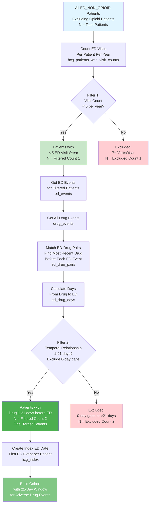

# Cohort Creation Pipeline - Comprehensive Guide

This document provides a **complete reference** for the Cohort Creation Pipeline, combining pipeline design, modular architecture, performance improvements, checkpointing, and usage instructions.

***

## 🎯 Overview

The Cohort Pipeline builds **event-based fact tables** for analytical cohorts used in clinical outcome and drug safety research. It generates two main cohorts:

- **OPIOID_ED:** Patients with opioid-related emergency department visits (targeted by ICD codes, e.g., F1120)
- **ED_NON_OPIOID:** Patients with non-opioid emergency department visits (targeted by HCG line codes)

Each cohort includes **target cases** and **5 matching controls** per case to ensure statistical robustness. The pipeline uses a **dual-target system**:
- **Target 1:** ICD/CPT codes (e.g., F1120 for opioid use disorder)
- **Target 2:** HCG-based ED visit identification (P51b, O11, P33 - using hcg_detail for precision)

When partitions have zero targets, the pipeline creates **control-only cohorts** using pre-computed average target counts to ensure complete coverage for model training.

***

## 🏗️ Architecture and Modular Structure

Following the October 2025 refactor, the pipeline has been fully modularized into **4 clean phases** under `2_create_cohort/phases/`.

### Directory Structure

```
2_create_cohort/
├── 0_create_cohort.py
└── phases/
    ├── __init__.py
    ├── common.py
    ├── phase1_data_preparation.py
    ├── phase2_event_processing.py
    ├── phase3_cohort_creation.py
    ├── phase4_finalization.py
    └── README.md
```


### Phase Summary

| Phase | File | Function | Description |
| :-- | :-- | :-- | :-- |
| Phase 1 | `phase1_data_preparation.py` | `run_phase1_data_preparation()` | Load and integrate medical + pharmacy data from APCD |
| Phase 2 | `phase2_event_processing.py` | `run_phase2_event_processing()` | Create unified event fact table and drug exposure |
| Phase 3 | `phase3_cohort_creation.py` | `run_phase3_step3_final_cohort_fact()` | Build final cohort fact table (target 5:1 control ratio, statistical independence, balanced temporal windows) |
| Phase 4 | `phase4_finalization.py` | `run_phase4_finalization()` | Validate QA and export to S3 |

**Key Benefits**

- Modular, testable, and maintainable
- Clear separation of concerns
- Backward-compatible imports
- No performance overhead

***

## ⚙️ Checkpoint and Resilience System

All pipeline phases now use the **centralized checkpoint system** to ensure job resilience and resumability.

### Checkpoint Features

- Step-level granularity (per-phase progress)
- Automatic resume after failure
- Metrics tracking (record counts, ratios, durations)
- Stored in S3 under `s3://pgx-repository/pgx-pipeline-status/create_cohort/{entity_id}/`

Example checkpoint JSON:

```json
{
  "pipeline_name": "create_cohort",
  "entity_id": "OPIOID_ED_65-74_2019",
  "status": "running",
  "steps": {
    "phase1_data_preparation": {
      "status": "completed",
      "metrics": {"medical_records": 1500000, "pharmacy_records": 850000}
    }
  }
}
```

**Classes:**

- `PipelineState` and `GlobalPipelineTracker` handle checkpoints, resuming, error logging, and status persistence.

***

## 🧩 DuckDB Configuration Enhancements

DuckDB handling has been fully aligned with the standardized system from the pharmacy pipeline:

- Uses `helpers/duckdb_utils.py`
- Corrects profiling commands (`PRAGMA disable_profiling`)
- Proper memory limit units (`16GB`, `900GB`)
- Full error propagation, no silent failures
- Configurable via command-line options or context settings

***

## 🧠 Event Fact Table Schema

### Core Identifiers

| Field | Description |
| :-- | :-- |
| `mi_person_key` | Patient ID |
| `event_date` | Event timestamp |
| `event_type` | 'medical' or 'pharmacy' |
| `data_source` | Originating data system |
| `age_band`, `event_year` | Stratification filters |

### Key Data Domains

- **Demographics:** imputed age, race, gender, payer type, and location
- **Medical Events:** ICD codes, CCS classification, provider and service metadata, **HCG fields** (hcg_setting, hcg_line, hcg_detail)
- **Pharmacy Events:** drug name, therapeutic class, and exposure timing
- **Cohort Metadata:** target/control indicator (`is_target_case`), legacy `target` column, cohort label, **cohort type** (OPIOID_ED, NON_OPIOID_ED, NON_ED), time window target columns (polypharmacy only), creation timestamp

### Cohort Classification Column

The `cohort` column tracks three types:
- **OPIOID_ED:** Target cases in opioid_ed_cohort (patients with opioid ICD codes in **ANY of the 10 ICD diagnosis columns**)
- **NON_OPIOID_ED:** Target cases in ed_non_opioid_cohort (HCG-based ED visits without opioid codes - checked across **ALL 10 ICD diagnosis columns**)
- **NON_ED:** Controls in both cohorts (non-ED visits)

### Temporal Fields and Drug Window Analysis

The pipeline includes temporal analysis fields that differ between cohorts:

#### Temporal Fields

| Field | Type | Description | OPIOID_ED | ED_NON_OPIOID |
| :-- | :-- | :-- | :-- | :-- |
| `first_opioid_ed_date` | STRING | Date of first opioid ED event (if any) | ✅ Populated | ❌ NULL |
| `first_ed_non_opioid_date` | STRING | Date of first non-opioid ED event (if any) | ❌ NULL | ✅ Populated |
| `days_to_target_event` | INTEGER | Days from event to first target event | ❌ NULL* | ✅ Calculated |
| `event_date` | STRING | Date of the event | ✅ All events | ✅ All events |
| `event_sequence` | INTEGER | Sequential order of events per patient (globally ordered across medical and pharmacy) | ✅ All events | ✅ All events |

\* For OPIOID_ED cohort, `days_to_target_event` is NULL. Users can calculate it from `event_date` and `first_opioid_ed_date` if needed.

#### Target Case Indicators

| Field | Type | Description | OPIOID_ED | ED_NON_OPIOID |
| :-- | :-- | :-- | :-- | :-- |
| `target` | INTEGER | **Legacy column** - Always 1 for OPIOID_ED/ED_NON_OPIOID cohorts (use `is_target_case` instead) | ✅ Always 1 | ✅ Always 1 |
| `is_target_case` | INTEGER | Target case indicator (1=target case, 0=control) | ✅ Populated | ✅ Populated (uses 21-day window) |
**Important Notes:**
- **`target` column is legacy** - Always set to 1 for both cohorts. Use `is_target_case` for actual target/control distinction.
- **`is_target_case` column** uses a fixed 21-day window for adverse drug event identification (excluding 0-day discharge prescriptions).
- The 21-day window captures ~90.5% of adverse drug events based on distribution analysis.

#### Cohort-Specific Temporal Behavior

**OPIOID_ED Cohort:**
- **Complete Drug History:** Includes ALL drug events for target cases (no time restriction)
- **No Drug Window Filtering:** All pharmacy events are included regardless of timing
- **Temporal Analysis:** Use `event_date` and `event_sequence` for temporal analysis
- **First Target Date:** `first_opioid_ed_date` is populated for all patients with target events
- **Days Calculation:** `days_to_target_event` is NULL; calculate manually if needed:
  ```sql
  SELECT 
    event_date,
    first_opioid_ed_date,
    datediff(first_opioid_ed_date::DATE, event_date::DATE) as days_to_target
  FROM opioid_ed_cohort
  WHERE first_opioid_ed_date IS NOT NULL
  ```

**ED_NON_OPIOID Cohort (Polypharmacy):**
- **Time-Windowed HCG Target Events:** Target is defined as HCG ED visits occurring within a 21-day window of drug events
- **Dual Filter System for True Adverse Drug Events:** The cohort applies two sequential filters to ensure only true adverse drug events are included:
  1. **ED Visit Frequency Filter:** Only includes patients with **<7 ED visits per year** (configurable via `NON_OPIOID_ED_MAX_ED_VISITS_PER_YEAR` in `py_helpers/constants.py`)
     - Rationale: Patients with 7+ ED visits per year are likely not true adverse drug events (may indicate chronic conditions or frequent ED utilization patterns)
     - Filter applied first: Counts ED visits per patient per year, excludes patients with 7+ visits
  2. **Temporal Drug-ED Relationship Filter:** Only includes patients where **most recent drug event is within 21 days of ED event** (excluding 0-day discharge prescriptions)
     - Rationale: True adverse drug events should have a temporal relationship between drug exposure and ED visit
     - Filter applied second: For each ED event, finds most recent drug event before it, calculates days between them, includes only patients with 1-21 days (0-day gaps excluded as likely discharge prescriptions)
- **Filter Pipeline:** The filtering logic uses a linear, sequential CTE approach for clarity and maintainability:
  - Each filter step is a separate CTE that builds on the previous step
  - This makes the logic easy to follow, debug, and modify
  - See [Filter Pipeline Diagram](#ed-non-opioid-filter-pipeline) below for visual representation
- **21-Day Time Window:** Single window captures ~90.5% of adverse drug events (excluding 0-day discharge prescriptions) based on distribution analysis
- **Time Window Lookback:** Applied to BOTH target cases AND controls for balanced comparison
- **Target Cases:** 
  - Reference date: First ED_NON_OPIOID event within 21-day window of drug event (index event per patient)
  - Includes: Medical events OR drug events within 21-day window before target
  - Target indicator: `is_target_case` (1 if drug event within 1-21 days before ED, excluding 0-day discharge prescriptions)
  - **Filtered to patients with <7 ED visits per year** (true adverse drug events only)
  - **21-day window captures ~90.5% of adverse drug events** (excluding 0-day discharge prescriptions) based on distribution analysis
- **Controls:**
  - Reference date: First non-ED medical event (fallback to first medical event if none)
  - Includes: Medical events OR drug events within 21-day window before reference date
  - Excluded if they have HCG target events within the 21-day window
  - **Balanced temporal windows** ensure fair comparison between targets and controls
- **First Target Date:** `first_ed_non_opioid_date` is populated for target cases only (NULL for controls)
- **Days Calculation:** `days_to_target_event` is pre-calculated for all events
  - For targets: Days to first ED_NON_OPIOID event within time window
  - For controls: Days to reference date (first non-ED medical event)
  - Positive values (1-21): Event occurred before reference date (included in 21-day window for adverse drug event patterns)
  - Zero: Event occurred on reference date (excluded for adverse drug event identification - likely discharge prescriptions)
  - Negative values: Event occurred after reference date (filtered out for drug events)

#### ED_NON_OPIOID Filter Pipeline {#ed-non-opioid-filter-pipeline}

The ED_NON_OPIOID cohort uses a sequential filtering approach to identify true adverse drug events. The pipeline applies two filters in sequence:



**Filter Statistics Logged:**
- Total patients before filters: `N_total`
- Excluded by Filter 1 (7+ visits): `N_excluded_1`
- Remaining after Filter 1: `N_filtered_1`
- Excluded by Filter 2 (0-day gaps or no temporal relationship): `N_excluded_2`
- Final target patients: `N_final = N_filtered_1 - N_excluded_2`

**Note on 0-Day Gap Exclusion:**
- 0-day gaps (drug filled on same day as ED visit) are excluded as they likely represent discharge prescriptions rather than adverse drug events
- Only drug events occurring 1-21 days before ED visit are considered for adverse drug event identification

#### 21-Day Window Justification

The 21-day window for adverse drug event identification is based on empirical distribution analysis of drug-to-ED event gaps (excluding 0-day discharge prescriptions). Analysis of a sample cohort (age_band=65-74, event_year=2019) showed the following distribution:

| Days from Drug to ED | ED Events | Percentage* | Cumulative |
|---------------------|-----------|-------------|------------|
| 1-7 days | 2,259 | 64.6% | 64.6% |
| 8-14 days | 616 | 17.6% | 82.2% |
| 15-21 days | 293 | 8.4% | **90.5%** |
| **Total 1-21 days** | **3,168** | **90.5%** | - |
| **Total excluding 0-day** | **3,497** | **100.0%** | - |

\* Percentages calculated excluding 0-day discharge prescriptions (3,054 events excluded from denominator)

**Key Findings:**
- The 21-day window captures **~90.5% of adverse drug events** (excluding 0-day discharge prescriptions)
- The majority of events (64.6%) occur within 7 days, consistent with acute adverse drug reactions
- Events beyond 21 days represent a smaller proportion and are less likely to be causally related to the ED visit
- The 21-day window balances **clinical relevance** (captures majority of events) with **causal plausibility** (events beyond 21 days have weaker temporal association)

**Clinical Rationale:**
- Most adverse drug events manifest within 1-2 weeks of drug initiation or dose changes
- A 21-day window aligns with typical drug half-lives and clinical monitoring periods
- Events beyond 21 days are more likely to be coincidental rather than causally related

**Example Log Output:**
```
→ [PHASE 3 STEP 3] Target case counts:
  ED_NON_OPIOID target patients (ed_non_opioid): 62,313
  ED_NON_OPIOID: Excluded 15,000 patients by filters (<7 visits per year AND drug 1-21 days before ED, excluding 0-day discharge prescriptions)
  ED_NON_OPIOID: Total before filters: 77,313, After filters: 62,313
  Drug-to-ED Gap Distribution (days_from_drug_to_ed, excluding 0-day discharge prescriptions):
    1-7 days: 2,259 ED events (64.6% of adverse drug events)
    8-14 days: 616 ED events (17.6% of adverse drug events)
    15-21 days: 293 ED events (8.4% of adverse drug events)
    Total 1-21 days: 3,168 ED events (90.5% of adverse drug events, excluding 0-day)
    Note: 3,054 0-day events (discharge prescriptions) excluded from calculation
```

#### Drug Window Filtering Logic

For ED_NON_OPIOID cohort, the pipeline applies balanced temporal filtering to BOTH targets and controls using a **21-day window**. **0-day gaps are excluded** to focus on adverse drug event patterns (discharge prescriptions filled on ED visit day are filtered out):
```sql
-- Target cases: include medical events OR drug events within 21 days before target
-- Controls: include medical events OR drug events within 21 days before reference date
WHERE (
  (is_target_case = 1 AND (
    event_type = 'medical' 
                  OR (event_type = 'pharmacy' 
                      AND days_to_target_event IS NOT NULL 
                      AND days_to_target_event >= 0 
                      AND days_to_target_event <= 21)
  ))
  OR (is_target_case = 0 AND (
    event_type = 'medical'
                  OR (event_type = 'pharmacy' 
                      AND days_to_target_event IS NOT NULL 
                      AND days_to_target_event >= 0 
                      AND days_to_target_event <= 21)
  ))
)
```

This ensures:
- **Balanced Comparison:** Both targets and controls have the same temporal window structure
- **Causality Assessment:** Only drugs prescribed within 30 days before the reference event are considered
- **Risk Window Analysis:** Supports identification of high-risk drug exposure periods
- **Temporal Relationships:** Enables analysis of drug exposure timing relative to reference events
- **Statistical Validity:** Prevents bias from unequal temporal data between targets and controls

***

## 📈 Control Sampling: 5:1 Ratio

Control selection ensures matched demographics:

- Age, gender, and race matching
- Geographical alignment (ZIP/county)
- Payer-type consistency
- **Target cases:** No overlap (opioid patients excluded from ED_NON_OPIOID - **checked across ALL 10 ICD diagnosis columns**)
- **Controls:** Can be reused across cohorts (same control can appear in both OPIOID_ED and ED_NON_OPIOID)

### Statistical Independence

**Important:** Controls are sampled **without replacement WITHIN each cohort** to maintain statistical independence:
- **Within a cohort:** Each control patient appears only once (no reuse within OPIOID_ED or ED_NON_OPIOID)
- **Across cohorts:** Same controls CAN be reused between OPIOID_ED and ED_NON_OPIOID cohorts (they are independent studies)
- Should achieve 5:1 ratio unless partition (age_band + event_year) is genuinely small
- If fewer than 5:1 ratio is available, all available controls are used
- Warnings are logged when ratio falls below 5:1 (expected only for small partitions)
- This ensures valid statistical inference and prevents overfitting in ML models

### Control-Only Cohorts

When a partition has **zero target cases** (no F1120 codes or HCG ED visits), the pipeline creates a **control-only cohort**:
- Uses pre-computed average target count from all partitions
- Samples `avg_targets * 5` controls (maintains 5:1 structure)
- All records marked as `is_target_case = 0` and `target = 0` (legacy)
- All records marked as `is_target_case = 0` (no multiclass targets - simplified to single 21-day window)
- Ensures every partition has a cohort file for complete model training coverage
- Logs clearly indicate "CONTROL-ONLY" status

***

## 🚀 Execution Instructions

### Pre-Computation Step (Required First)

Before running the cohort pipeline, run the target frequency analysis script (which automatically pre-computes target averages):

```bash
# Analyze target codes and automatically pre-compute averages for cohort creation
python 1a_apcd_input_data/7_target_frequency_analysis.py --profile mushin
```

This creates `cohort_target_averages.json` in the project root, which Phase 3 uses for control-only cohort sizing. The pre-computation happens automatically as part of the target frequency analysis.

**Output:** `cohort_target_averages.json` containing:
- Average F1120 targets per partition
- Average HCG ED visit targets per partition
- Combined average (F1120 + HCG ED) for control-only cohorts
- Per-partition counts for reference

### SQL Workflow

```sql
\i phase1_data_preparation.sql
\i phase2_step1_event_fact_table.sql
\i phase2_step2_drug_exposure.sql
\i phase3_step3_final_cohort_fact.sql
\i phase4_complete_pipeline.sql
```


### Python Command-Line Interface

```bash
# Run with pre-computed averages (recommended)
python 0_create_cohort.py --age-band "65-74" --event-year 2016 --cohort both

# Fixed 21-day window for adverse drug event identification
# Note: Time window only applies to ED_NON_OPIOID (polypharmacy) cohort
# OPIOID_ED cohort uses target event itself (no time window)
# 0-day gaps are excluded (likely discharge prescriptions)
# The --time-window-days argument is deprecated (window is fixed at 21 days)
```

### Batch Processing Scripts

**Important:** The batch processing scripts (`run_series_ed_non_opioid.py` and `run_series_opioid_ed.py`) are designed to process **ALL age_band/year combinations** for their respective cohort types, not just a single combination.

**Behavior:**
- These scripts loop through all predefined age bands (0-12, 13-24, 25-44, 45-54, 55-64, 65-74, 75-84, 85-114) and event years (2016, 2017, 2018, 2019, 2020). The last band 85-114 combines the former 85-94 and 95-114.
- **85-114:** Gold medical/pharmacy can be either a single `age_band=85-114` partition or **both** `age_band=85-94` and `age_band=95-114`; the pipeline treats the two partitions as one (UNION ALL) when 85-114 is requested.
- With `--skip-existing`, they check S3 for existing cohorts and only process missing combinations
- **Note:** `check_existing_cohorts()` checks for BOTH `opioid_ed` and `ed_non_opioid` cohorts. If either is missing for a given age_band/year, that combination will be processed
- If you're starting fresh (no cohorts exist), all 36 combinations (9 age bands × 4 years) will be processed

**Example Usage:**
```bash
# Process all ed_non_opioid cohorts (skips existing ones)
python 2_create_cohort/run_series_ed_non_opioid.py --skip-existing --concurrent-workers 1

# Process all opioid_ed cohorts (skips existing ones)
python 2_create_cohort/run_series_opioid_ed.py --skip-existing --concurrent-workers 1
```

**Idempotent state:** If the pipeline exits after writing the cohort parquet but before saving "completed" state, the entity can stay "running" in `pgx-pipeline-status/create_cohort/`. Re-running the same cohort/age_band/year will detect existing output, update state to completed, and exit (no re-run). To fix a stuck "running" entity without re-running the pipeline, use `--repair-state`: e.g. `python 2_create_cohort/0_create_cohort.py --cohort ed_non_opioid --age-band 85-114 --event-year 2016 --repair-state`.

**To Process a Single Cohort:**
If you only want to process one specific age_band/year combination, use `0_create_cohort.py` directly:

```bash
# Process only one specific cohort
python 2_create_cohort/0_create_cohort.py \
  --cohort ed_non_opioid \
  --age-band 75-84 \
  --event-year 2019 \
  --concurrent-workers 1
```

### Advanced Usage

```bash
# With custom AWS profile
python precompute_target_averages.py --profile mushin

# Pipeline with custom settings
python 0_create_cohort.py \
  --age-band "65-74" \
  --event-year 2019 \
  --cohort both \
  # --time-window-days is deprecated (window is fixed at 21 days) \
  --concurrent-workers 3 \
  --threads 8 \
  --mem-gb 16 \
  --tmp-dir /tmp/duckdb_cohort
```

**Time Window Configuration:**
- `--time-window-days`: **DEPRECATED** - Time window is now fixed at 21 days (this argument is ignored)
- Only applies to ED_NON_OPIOID (polypharmacy) cohort
- OPIOID_ED cohort always uses target event itself (no time window)
- Fixed 21-day window captures ~90.5% of adverse drug events (excluding 0-day discharge prescriptions)


***

## 📊 S3 Output Structure

Cohorts are organized **by cohort name first, then by year and age-band partitions**:

```
s3://pgxdatalake/gold/cohorts_{TARGET_NAME}/
├── cohort_name=opioid_ed/
│   ├── event_year=2019/
│   │   ├── age_band=45-54/
│   │   │   └── cohort.parquet
│   │   ├── age_band=55-64/
│   │   │   └── cohort.parquet
│   │   └── ...
│   ├── event_year=2020/
│   │   └── ...
│   └── ...
└── cohort_name=ed_non_opioid/
    ├── event_year=2019/
    │   ├── age_band=45-54/
    │   │   └── cohort.parquet
    │   └── ...
    └── ...
```

**Example:** `s3://pgxdatalake/gold/cohorts_F1120/cohort_name=opioid_ed/event_year=2019/age_band=45-54/cohort.parquet`

**Path Structure:** `cohorts_{TARGET_NAME}/cohort_name={cohort}/event_year={year}/age_band={age_band}/cohort.parquet`

**Note:** All cohorts are saved (including control-only cohorts) to ensure complete coverage. Control-only cohorts are clearly logged with "CONTROL-ONLY" status.


***

## 🧪 QA and Validation Checks

- 100% imputed demographics
- Cohort exclusivity for targets (opioid patients excluded from ED_NON_OPIOID **checked across ALL 10 ICD diagnosis columns**), controls can overlap
- 5:1 control ratio (or control-only cohorts when targets = 0)
- Event classification integrity
- **Dual-target validation:** F1120 ICD codes (checked in **ALL 10 ICD diagnosis columns**) and HCG ED visits
- **HCG field presence:** hcg_setting, hcg_line, hcg_detail loaded from gold tier
- **Cohort column values:** OPIOID_ED, NON_OPIOID_ED, NON_ED
- **Comprehensive ICD checking:** All opioid code validations check all 10 ICD diagnosis columns
- QA summary logged in checkpoints

Example QA log:

```
→ Phase 1 QA: Medical: 2.5M, Pharmacy: 5.0M
→ Phase 2 QA: Event fact table created (7.5M events)
  F1120 records: 36,931 (640 distinct patients)
  HCG ED visits: 125,000 (8,500 distinct patients)
→ Phase 3 QA: Ratio 5.0:1 confirmed
  OPIOID_ED: 640 targets, 3,200 controls
  ED_NON_OPIOID: 8,500 targets, 42,500 controls
→ Phase 4 QA: Pipeline complete
  OPIOID_ED cohort saved (CONTROL-ONLY) to S3  [if zero targets]
```


***

## ⚡ Performance Metrics

| Metric | Original | Optimized | Gain |
| :-- | :-- | :-- | :-- |
| Steps | 15 | 5 | 67% fewer |
| Execution Time | 45–60 min | 20–30 min | 50% faster |
| Memory | High | Medium | 40% less |
| Duplication | High | Low | 80% reduced |

Runs efficiently on 8–16 GB memory and supports 10M+ events per cohort.

### Recent Technical Optimizations

The pipeline has been optimized based on deep technical reviews to ensure correctness, performance, and reproducibility:

**SQL Query Optimizations:**
- **NOT EXISTS instead of NOT IN:** All subqueries use `NOT EXISTS` for safer NULL handling and better DuckDB performance
- **Hash-based deterministic sampling:** Replaced `ORDER BY RANDOM()` with hash-based sampling (`ABS(hash(mi_person_key)) % 10000`) for faster, deterministic control selection
- **Global event ordering:** `event_sequence` is now computed AFTER `UNION ALL` to ensure true chronological ordering across medical and pharmacy events
- **Materialized CTEs:** Frequently used subqueries (e.g., `opioid_patients`) are materialized once to avoid repeated computation

**Code Quality Improvements:**
- **ICD normalization consistency:** Centralized normalization logic to prevent silent cohort drift across phases
- **Target column fix:** `target` column now correctly reflects `is_target_case` instead of hardcoded values
- **Partition-safe profiling:** Profiling filenames include `{age_band}_{event_year}` to prevent overwrites in parallel runs
- **Corrupted file detection:** Local sync checks file size > 0 to detect and handle corrupted files

**Pipeline Safety:**
- **Fallback warnings:** Clear warnings when fallback cohort logic is used (Phase 3 skipped)
- **Schema validation:** Comprehensive schema checks with dev validation mode for debugging
- **Memory management:** Dynamic memory limits based on concurrent workers to prevent OOM
- **DuckDB temp cleanup:** Automatic cleanup of DuckDB temporary files at startup and completion

### Opioid_ed Age-Band Cohort Sizes (F1120, 2016–2019)

For the opioid ED cohort (`cohort_name=opioid_ed`) built in this pipeline, the **downstream feature-importance runtime** is strongly influenced by both the **event workload** (rows) and the **number of distinct patients** in the cohort parquet partitions in `data/cohorts_F1120/cohort_name=opioid_ed/`.

Using **2016–2018 as training** and **2019 as test**:

- **Event-level row counts (workload)** per age band:
  - **0–12**: train = 2,186, test = 1,936  
  - **13–24**: train = 435,982, test = 176,151  
  - **25–44**: train = 4,651,487, test = 3,044,733  
  - **45–54**: train = 2,770,352, test = 1,382,862  
  - **55–64**: train = 3,231,509, test = 1,392,618  
  - **65–74**: train = 2,857,618, test = 1,015,348  
  - **75–84**: train = 1,227,068, test = 370,364  
  - **85–94**: train = 274,315, test = 96,795  
  - **95–114**: train = 10,918, test = 2,754  

- **Distinct patients** per age band:
  - **0–12**: train = 78, test = 66  
  - **13–24**: train = 9,834, test = 3,840  
  - **25–44**: train = 78,296, test = 50,400  
  - **45–54**: train = 32,070, test = 16,950  
  - **55–64**: train = 31,507, test = 14,898  
  - **65–74**: train = 23,356, test = 9,150  
  - **75–84**: train = 8,477, test = 2,976  
  - **85–94**: train = 1,878, test = 726  
  - **95–114**: train = 77, test = 24  

Taking `opioid_ed 25–44` as a **baseline** for downstream feature-importance cost (factor = 1.0 for `(train + test)` event rows), the **relative size factors** are approximately:

- **0–12**: ≈ 0.001×  
- **13–24**: ≈ 0.08×  
- **25–44**: 1.00× (baseline)  
- **45–54**: ≈ 0.54×  
- **55–64**: ≈ 0.60×  
- **65–74**: ≈ 0.50×  
- **75–84**: ≈ 0.21×  
- **85–94**: ≈ 0.05×  
- **95–114**: ≈ 0.002×  

This means that, for a fixed MC‑CV configuration in the feature-importance pipeline (e.g., 25 splits, 3 tree models with permutation importance), **25–44 is by far the heaviest age band** in terms of **event workload**, with 45–74 at roughly half to 60% of that cost, and the youngest/oldest bands contributing only a tiny fraction of the total runtime despite having meaningful patient counts.

### ED_NON_OPIOID (Polypharmacy) Age-Band Cohort Sizes (F1120, 2016–2019)

For the polypharmacy ED cohort (`cohort_name=non_opioid_ed`), which is the primary focus for **older age bands** in downstream feature-importance analysis, the cohort parquet partitions in `data/cohorts_F1120/cohort_name=non_opioid_ed/` have substantially larger event workloads and patient counts:

- **Event-level row counts (workload), train = 2016–2018, test = 2019:**
  - **0–12**: train = 32,482,174, test = 13,095,946  
  - **13–24**: train = 30,064,091, test = 12,717,593  
  - **25–44**: train = 70,326,824, test = 29,280,711  
  - **45–54**: train = 52,120,942, test = 20,750,036  
  - **55–64**: train = 71,132,187, test = 29,816,173  
  - **65–74**: train = 135,465,040, test = 50,047,383  
  - **75–84**: train = 87,267,781, test = 32,780,611  
  - **85–94**: train = 35,670,313, test = 12,278,221  
  - **95–114**: train = 3,219,193, test = 1,185,156  

- **Distinct patients, train = 2016–2018, test = 2019:**
  - **0–12**: train = 1,215,320, test = 870,021  
  - **13–24**: train = 954,442, test = 696,076  
  - **25–44**: train = 1,542,990, test = 1,168,512  
  - **45–54**: train = 831,967, test = 630,978  
  - **55–64**: train = 884,664, test = 713,998  
  - **65–74**: train = 919,654, test = 766,298  
  - **75–84**: train = 462,222, test = 391,003  
  - **85–94**: train = 181,679, test = 136,146  
  - **95–114**: train = 21,546, test = 14,729  

If we take `non_opioid_ed 65–74` as the **baseline** (it has the largest `(train + test)` event workload), the **relative event workload factors** are:

- **0–12**: ≈ 0.25×  
- **13–24**: ≈ 0.23×  
- **25–44**: ≈ 0.54×  
- **45–54**: ≈ 0.39×  
- **55–64**: ≈ 0.54×  
- **65–74**: 1.00× (baseline)  
- **75–84**: ≈ 0.65×  
- **85–94**: ≈ 0.26×  
- **95–114**: ≈ 0.02×  

For a fixed downstream feature-importance configuration (e.g., 25 splits, 3 tree models, exact XGBoost), **non_opioid_ed 65–74 is the heaviest polypharmacy age band** by event workload. Neighboring older bands (55–64, 75–84) are on the same order of magnitude, while younger and extreme-age bands contribute a smaller fraction of the total MC‑CV runtime despite covering large patient populations.

***

## 👩‍🔬 Testing and Debugging

### Test a Sample Run

```bash
python create_cohort.py --age-band "65-74" --event-year 2019 --cohort OPIOID_ED
```


### Verify Checkpoints

```python
from helpers.pipeline_state import PipelineState
state = PipelineState("create_cohort", "OPIOID_ED_65-74_2019", logger)
print(state.get_progress())
```


***

## ✅ Best Practices

**Pre-computation:**

- Target averages are automatically computed by `7_target_frequency_analysis.py` (run this before cohort creation)
- Re-run if gold tier data changes significantly
- Check `cohort_target_averages.json` exists before batch runs

**When adding phases:**

- Create `phases/phaseN_<description>.py`
- Use `common.py` utilities
- Add to `__init__.py`
- Include checkpoint and error handling
- Document updates in `phases/README.md`

**When editing:**

- Keep each phase self-contained
- Use logging and checkpointing
- Update documentation and unit tests
- Ensure HCG fields are included in medical data loading
- Maintain dual-target classification logic (ICD codes + HCG ED visits)

**Control-Only Cohorts:**

- Model training code should filter by `is_target_case = 1` if only targets are needed
- Control-only cohorts can be used as negative-only examples
- Consider excluding from training or weighting differently in loss function

**Target Column Usage:**

- **Use `is_target_case`** for target/control distinction (not the legacy `target` column)
- **`is_target_case`** uses a fixed 21-day window for adverse drug event identification
- 0-day gaps are excluded (likely discharge prescriptions filled on ED visit day)

***

## 📚 Related References

- **SQL Reference**: See [SQL Reference: Detailed Queries](#sql-reference-detailed-queries) section below for complete SQL reference
- `docs/README_s3_datalake.md` — S3 paths and data lake structure
- `docs/README_duckdb_dev.md` — Database performance tuning
- `docs/README_preprocessing.md` — Pre-imputation overview
- `2_create_cohort/phases/` — Phase-level logic reference
- `1a_apcd_input_data/7_target_frequency_analysis.py` — Target frequency analysis (includes automatic pre-computation of cohort target averages)
- `control_only_cohort_analysis.md` — Detailed analysis of control-only cohort strategy

***

## 🎯 Target Identification System

### Dual-Target Architecture

The pipeline uses two independent target identification methods:

1. **ICD/CPT Code Targets** (OPIOID_ED cohort):
   - Primary: F1120 (Opioid Use Disorder, Uncomplicated)
   - Configurable via environment variables (see below)
   - Codes normalized to F1120 format in gold tier (no dots, no spaces)
   - **Comprehensive checking:** All 10 ICD diagnosis columns are checked (primary through ten), not just `primary_icd_diagnosis_code`

2. **HCG-Based ED Visit Targets** (ED_NON_OPIOID cohort):
   - Uses Healthcare Cost Group (HCG) line codes and **details** for precise identification:
     - `P51 - ER Visits and Observation Care` with detail `P51b - PHY ED Visits and Observation Care - ED Visits`
       - **Includes:** Only actual ED visits (P51b)
       - **Excludes:** Observation care visits (P51a) - these are not true ED visits for adverse drug event identification
     - `O11 - Emergency Room` (all details)
     - `P33 - Urgent Care Visits` (all details)
   - **Naming:** We use **O11_P** as the canonical identifier for the model_events target-date column (e.g. `first_o11_p_date` in Step 4), to match the style of F11.20 for opioid_ed. **O11_P includes all qualifying ED HCG codes** (P51b, O11, P33) as defined in the cohort logic above.
   - **Precision:** Uses `hcg_detail` field to distinguish actual ED visits from observation care
   - Identifies ED visits regardless of diagnosis codes
   - Always classified as `'ed_non_opioid'` in event classification
   - **Opioid exclusion:** All opioid patients are excluded by checking ALL 10 ICD diagnosis columns

### Classification Priority

Event classification follows this priority:
1. **Target ICD/CPT codes** → `'target'` (or `'opioid_ed'` if no dynamic targeting) - **Checks ALL 10 ICD diagnosis columns**
2. **HCG ED visits** → `'ed_non_opioid'`
3. **Other events** → `'non_target'` (or `'ed_non_opioid'` if default mode)

**Important:** The implementation uses a helper function `get_opioid_icd_sql_condition()` from `helpers_1997_13/constants.py` to generate comprehensive SQL that checks all 10 ICD diagnosis columns (`primary_icd_diagnosis_code`, `two_icd_diagnosis_code`, ..., `ten_icd_diagnosis_code`). This ensures no opioid-related events are missed regardless of which diagnosis position the code appears in.

### Environment Variables for Dynamic Targeting

The pipeline supports dynamic target selection via environment variables:

| Variable | Description | Example |
| :-- | :-- | :-- |
| `PGX_TARGET_NAME` | Human-readable target name | `F1120` |
| `PGX_TARGET_ICD_CODES` | Comma-separated ICD codes | `F1120,F1121` |
| `PGX_TARGET_CPT_CODES` | Comma-separated CPT codes | `99281,99282` |
| `PGX_TARGET_ICD_PREFIXES` | Comma-separated ICD prefixes | `F11,F12` |
| `PGX_TARGET_CPT_PREFIXES` | Comma-separated CPT prefixes | `9928` |

**Usage Examples:**

```bash
# Set F1120 as target
export PGX_TARGET_NAME="F1120"
export PGX_TARGET_ICD_CODES="F1120"

# Or use command-line arguments
python 0_create_cohort.py \
  --age-band "65-74" \
  --event-year 2019 \
  --target-name "F1120" \
  --target-icd-codes "F1120"
```

**Note:** When environment variables are set, the pipeline uses generic `'target'`/`'non_target'` classification labels. When unset, it defaults to `'opioid_ed'`/`'ed_non_opioid'` classification.

### DuckDB Parallelization Configuration

The pipeline supports parallelization via environment variables:

| Variable | Description | Default |
| :-- | :-- | :-- |
| `PGX_THREADS_PER_WORKER` | Number of DuckDB threads for query execution | `8` |
| `PGX_S3_UPLOADER_THREAD_LIMIT` | Maximum uploader threads for S3 multi-part uploads | DuckDB default |
| `PGX_S3_UPLOADER_MAX_FILESIZE` | Max file size for part size calculation (e.g., "5368709120" for 5GB) | DuckDB default |
| `PGX_S3_UPLOADER_MAX_PARTS_PER_FILE` | Max parts per file for part size calculation | DuckDB default |

**Important:** `s3_max_connections` is **not** a valid DuckDB configuration parameter and will cause errors. S3 parallelization is handled automatically by DuckDB. Use `s3_uploader_thread_limit` if you need to tune upload performance.

### Memory Management for Parallel Workers

When running multiple cohort creation jobs in parallel (e.g., via `ThreadPoolExecutor` in a notebook), each worker needs to know the total number of concurrent workers to properly allocate memory. **This prevents memory oversubscription and OOM kills.**

**Setting Worker Count in Notebook:**

You have two options:

**Option 1: Pass as CLI argument (cleanest):**

```python
MAX_WORKERS = 3  # Your notebook variable

def run_cohort(job):
    cmd = [
        python_bin, script_path,
        "--age-band", job["age_band"],
        "--event-year", str(job["event_year"]),
        "--concurrent-workers", str(MAX_WORKERS),  # Pass directly!
        # ... other args
    ]
    # ... launch subprocess

# Now launch workers
with ThreadPoolExecutor(max_workers=MAX_WORKERS) as executor:
    # ... submit jobs
```

**Option 2: Set environment variable (if you prefer):**

```python
import os

MAX_WORKERS = 3  # Your notebook variable

# Set as environment variable (code checks for this too)
os.environ['MAX_WORKERS'] = str(MAX_WORKERS)
# OR use PGX_COHORT_WORKERS for more explicit naming

# Now launch workers
with ThreadPoolExecutor(max_workers=MAX_WORKERS) as executor:
    # ... submit jobs
```

**Recommendation:** Use Option 1 (CLI argument) - it's cleaner and doesn't require environment variable management.

**How It Works:**

- Each worker process detects `PGX_COHORT_WORKERS` from the environment
- Calculates per-worker memory limit: `(60% of total system memory) / number of workers`
- Sets DuckDB memory limit to prevent oversubscription
- Example: 3 workers on 1TB system = ~200GB per worker (600GB total + 400GB buffer)

**Environment Variable Priority:**

1. `PGX_COHORT_WORKERS` (explicit name, preferred for clarity)
2. `MAX_WORKERS` (works too - code checks for this automatically)
3. Default: `3` workers (if neither is set)

**Note:** Just set `os.environ['MAX_WORKERS'] = str(MAX_WORKERS)` in your notebook - no need for the extra `PGX_COHORT_WORKERS` step unless you prefer explicit naming.

**Logging:**

The pipeline logs the detected worker count and calculated memory limit:
```
→ [CONFIG] Detected PGX_COHORT_WORKERS=3 from environment
→ [CONFIG] DuckDB memory limit: 200GB (for 3 workers, 1000GB total system memory, 600GB available for DuckDB)
```

**Example:**
```bash
export PGX_THREADS_PER_WORKER=16
export PGX_S3_UPLOADER_THREAD_LIMIT=16
python 0_create_cohort.py --age-band "65-74" --event-year 2019 --operation-type s3_heavy
```

## 🏁 Summary

The **Cohort Creation Pipeline v4.3+** now features:
- **Modular, checkpoint-enabled architecture** with 4 clean phases
- **Dual-target system** (ICD codes + HCG ED visits) for comprehensive cohort identification
- **Precise HCG identification:** Uses `hcg_detail` to distinguish actual ED visits (P51b) from observation care (P51a)
- **Comprehensive ICD diagnosis checking** across all 10 ICD diagnosis columns (primary through ten) to ensure no opioid patients are missed or misclassified
- **Control-only cohort logic** ensuring complete partition coverage for model training
- **Pre-computed averages** for efficient control-only cohort sizing
- **HCG field integration** (hcg_setting, hcg_line, hcg_detail) from gold tier
- **Cohort classification column** (OPIOID_ED, NON_OPIOID_ED, NON_ED) for flexible filtering
- **High-performance DuckDB integration** with optimized memory and query handling

The pipeline achieves improved testability, maintainability, and resilience—while reducing runtime and resource usage by over 50%.

**Last Updated:** 2026-01-23
**Version:** 4.4 (Dual-Target + Control-Only Cohorts + HCG Integration + Comprehensive ICD Diagnosis Checking + Precise HCG Detail Matching)
**Status:** Production-Ready
**Authors:** PGx Analytics Engineering Team

---

## 📚 SQL Reference

For detailed SQL queries used in each phase of the pipeline, see the [SQL Reference Section](#sql-reference-detailed-queries) below.

---

<span style="display:none">[^1][^2][^3]</span>

<div align="center">⁂</div>

[^1]: Cohort_Pipeline_README.md

[^2]: Cohort_Modularization_README.md

[^3]: Cohort_Pipeline_Updates.md

---

# SQL Reference: Detailed Queries

This section provides a comprehensive reference for all SQL queries used in the Cohort Creation Pipeline. Each phase is documented with explanations, parameters, and example queries.

**Last Updated:** 2026-01-23  
**Version:** 5.0 (Simplified 21-Day Window - Removed Multiclass Targets)

---

## Phase 1: Data Preparation

### Overview
Loads and filters medical and pharmacy data from the APCD gold tier, creating normalized views for downstream processing.

### Medical Data Loading

**View:** `medical_base`

```sql
CREATE OR REPLACE VIEW medical_base AS
SELECT
    CAST(mi_person_key AS VARCHAR) AS mi_person_key,
    -- Map gold medical fields to normalized names used downstream
    member_age_dos AS age_imputed,
    member_gender AS gender_imputed,
    member_race AS race_imputed,
    member_zip_code_dos AS zip_imputed,
    member_county_dos AS county_imputed,
    payer_type AS payer_imputed,
    primary_icd_diagnosis_code,
    -- Carry forward CPT/procedure fields for event features
    procedure_code,
    cpt_mod_1_code,
    cpt_mod_2_code,
    -- HCG fields for ED visit identification
    hcg_setting,
    hcg_line,
    hcg_detail,
    event_date,
    CAST(event_year AS INTEGER) AS event_year
FROM read_parquet('s3://pgxdatalake/gold/medical/age_band={age_band}/event_year={event_year}/medical_data.parquet')
WHERE mi_person_key IS NOT NULL
  AND CAST(mi_person_key AS VARCHAR) <> ''
  AND event_date IS NOT NULL;
```

**Parameters:**
- `{age_band}`: Age band partition (e.g., "45-54", "65-74")
- `{event_year}`: Event year partition (e.g., 2019, 2020)

**Purpose:** Loads raw medical data from S3 and normalizes column names.

---

### Medical Data Filtering

**View:** `medical`

```sql
CREATE OR REPLACE VIEW medical AS
SELECT *
FROM medical_base
WHERE age_imputed IS NOT NULL
  AND age_imputed BETWEEN 1 AND 114
  AND event_date >= '{event_year}-01-01'
  AND event_date <= '{event_year}-12-31';
```

**Purpose:** Applies data quality filters (valid age range, date range).

---

### Pharmacy Data Loading

**View:** `pharmacy_base`

```sql
CREATE OR REPLACE VIEW pharmacy_base AS
SELECT 
    CAST(mi_person_key AS VARCHAR) AS mi_person_key,
    NULL::INTEGER AS age_imputed,
    NULL::VARCHAR AS gender_imputed,
    NULL::VARCHAR AS race_imputed,
    NULL::VARCHAR AS zip_imputed,
    NULL::VARCHAR AS county_imputed,
    NULL::VARCHAR AS payer_imputed,
    drug_name,
    NULL::VARCHAR AS therapeutic_class_1,
    -- Build event_date from incurred_date for cohort processing
    TRY_STRPTIME(CAST(incurred_date AS VARCHAR), '%Y%m%d') AS event_date,
    CAST(event_year AS INTEGER) AS event_year
FROM read_parquet('s3://pgxdatalake/gold/pharmacy/age_band={age_band}/event_year={event_year}/pharmacy_data.parquet')
WHERE mi_person_key IS NOT NULL
  AND CAST(mi_person_key AS VARCHAR) <> ''
  AND incurred_date IS NOT NULL
  AND TRY_STRPTIME(CAST(incurred_date AS VARCHAR), '%Y%m%d') IS NOT NULL;
```

**Purpose:** Loads pharmacy data and converts `incurred_date` (YYYYMMDD format) to `event_date`.

---

### Pharmacy Data Filtering

**View:** `pharmacy`

```sql
CREATE OR REPLACE VIEW pharmacy AS
SELECT *
FROM pharmacy_base
WHERE event_date IS NOT NULL
  AND event_date >= '{event_year}-01-01'
  AND event_date <= '{event_year}-12-31'
  AND drug_name IS NOT NULL
  AND drug_name <> '';
```

**Purpose:** Filters pharmacy data to valid date range and non-empty drug names.

---

## Phase 2: Event Processing

### Overview
Creates a unified event fact table that combines medical and pharmacy events with classification logic for target identification.

### Event Classification Logic

The classification logic uses a priority-based CASE statement:

**Priority Order:**
1. **Target ICD/CPT codes** → `'target'` (or `'opioid_ed'` if no dynamic targeting)
2. **HCG ED visits** → `'ed_non_opioid'`
3. **Other events** → `'non_target'` (or `'ed_non_opioid'` if default mode)

**Important:** ICD code checking now includes **ALL 10 ICD diagnosis columns** (primary through ten), not just `primary_icd_diagnosis_code`. This ensures no opioid-related events are missed regardless of which diagnosis position the code appears in.

**Dynamic Classification (when `PGX_TARGET_ICD_CODES` is set):**

```sql
CASE 
    WHEN (primary_icd_diagnosis_code IN ('F1120', ...) 
          OR two_icd_diagnosis_code IN ('F1120', ...)
          OR three_icd_diagnosis_code IN ('F1120', ...)
          -- ... through ten_icd_diagnosis_code
          OR procedure_code IN (...)) THEN 'target'
    WHEN (hcg_line = 'P51 - ER Visits and Observation Care' AND hcg_detail = 'P51b - PHY ED Visits and Observation Care - ED Visits')
         OR hcg_line = 'O11 - Emergency Room'
         OR hcg_line = 'P33 - Urgent Care Visits' THEN 'ed_non_opioid'
    ELSE 'non_target'
END
```

**Default Classification (opioid-specific):**

```sql
CASE 
    WHEN primary_icd_diagnosis_code IN ('F1120', 'F1121', ...)
         OR two_icd_diagnosis_code IN ('F1120', 'F1121', ...)
         OR three_icd_diagnosis_code IN ('F1120', 'F1121', ...)
         -- ... through ten_icd_diagnosis_code
         THEN 'opioid_ed'
    WHEN (hcg_line = 'P51 - ER Visits and Observation Care' AND hcg_detail = 'P51b - PHY ED Visits and Observation Care - ED Visits')
         OR hcg_line = 'O11 - Emergency Room'
         OR hcg_line = 'P33 - Urgent Care Visits' THEN 'ed_non_opioid'
    ELSE 'ed_non_opioid'
END
```

**Note:** The actual implementation uses a helper function `get_opioid_icd_sql_condition()` from `helpers_1997_13/constants.py` to generate the comprehensive SQL condition across all 10 ICD diagnosis columns.

---

### Unified Event Fact Table

**View:** `unified_event_fact_table`

```sql
CREATE OR REPLACE VIEW unified_event_fact_table AS
-- Medical events
SELECT 
    mi_person_key,
    event_date,
    'medical' as event_type,
    'medical' as data_source,
    age_imputed,
    gender_imputed as member_gender,
    race_imputed as member_race,
    zip_imputed,
    county_imputed,
    payer_imputed,
    primary_icd_diagnosis_code,
    NULL as drug_name,
    NULL as therapeutic_class_1,
    -- CPT/procedure codes (medical)
    procedure_code,
    cpt_mod_1_code,
    cpt_mod_2_code,
    -- HCG fields for ED visit identification
    hcg_setting,
    hcg_line,
    hcg_detail,
    -- Event classification (dynamic via env or default)
    {classification_sql} as event_classification,
    -- Event sequence number
    ROW_NUMBER() OVER (PARTITION BY mi_person_key ORDER BY event_date) as event_sequence
FROM medical
WHERE primary_icd_diagnosis_code IS NOT NULL

UNION ALL

-- Pharmacy events
SELECT 
    mi_person_key,
    event_date,
    'pharmacy' as event_type,
    'pharmacy' as data_source,
    age_imputed,
    gender_imputed as member_gender,
    race_imputed as member_race,
    zip_imputed,
    county_imputed,
    payer_imputed,
    NULL as primary_icd_diagnosis_code,
    drug_name,
    therapeutic_class_1,
    -- CPT/procedure codes not present in pharmacy (set NULLs)
    NULL as procedure_code,
    NULL as cpt_mod_1_code,
    NULL as cpt_mod_2_code,
    -- HCG fields not present in pharmacy (set NULLs)
    NULL as hcg_setting,
    NULL as hcg_line,
    NULL as hcg_detail,
    -- Use same classification expression to preserve target logic across union
    {classification_sql} as event_classification,
    ROW_NUMBER() OVER (PARTITION BY mi_person_key ORDER BY event_date) as event_sequence
FROM pharmacy
WHERE drug_name IS NOT NULL;
```

**Key Features:**
- Combines medical and pharmacy events into a single unified table
- Adds `event_classification` based on target codes and HCG ED visits
- Includes `event_sequence` to track chronological order per patient
- Preserves all demographic and clinical fields

---

## Phase 3: Cohort Creation

### Overview
Creates two cohorts (OPIOID_ED and ED_NON_OPIOID) with a target 5:1 control-to-target ratio. Patients with opioid ICD codes are completely excluded from ED_NON_OPIOID cohort.

**Key Features:**
- **Statistical Independence:** Controls are sampled without replacement (no reuse)
- **Temporal Fields:** Calculates `first_opioid_ed_date`, `first_ed_non_opioid_date`, and `days_to_target_event`
- **Balanced Windows:** ED_NON_OPIOID applies same 30-day lookback window to both targets and controls
- **Column Matching:** All columns match between target cases and controls
- **Ratio Warnings:** Logs warnings when ratio falls below 5:1

### OPIOID_ED Cohort (Normal Case - Has Targets)

**View:** `opioid_ed_cohort`

```sql
CREATE OR REPLACE VIEW opioid_ed_cohort AS
WITH target_cases AS (
    SELECT DISTINCT mi_person_key
    FROM unified_event_fact_table
    WHERE event_classification = 'target'  -- or 'opioid_ed' if no dynamic targeting
),
first_target_dates AS (
    -- Find first target event date per patient
    SELECT 
        mi_person_key,
        MIN(event_date) as first_opioid_ed_date
    FROM unified_event_fact_table
    WHERE event_classification = 'target'
    GROUP BY mi_person_key
),
control_candidates AS (
    SELECT DISTINCT mi_person_key
    FROM unified_event_fact_table
    WHERE event_classification != 'target'
      AND mi_person_key NOT IN (SELECT mi_person_key FROM target_cases)
),
sampled_controls AS (
    -- Sample distinct controls only (no reuse to maintain statistical independence)
    -- Use all available controls if fewer than 5:1 ratio
    WITH target_count AS (
        SELECT COUNT(*) as target_cnt FROM target_cases
    ),
    needed_count AS (
        SELECT tc.target_cnt * 5 as needed FROM target_count tc
    ),
    available_controls AS (
        SELECT COUNT(*) as available FROM control_candidates
    )
    SELECT 
        mi_person_key
    FROM control_candidates
    ORDER BY RANDOM()
    LIMIT (
        SELECT LEAST(
            (SELECT needed FROM needed_count),
            (SELECT available FROM available_controls)
        )
    )
)
SELECT 
    uef.*,
    1 as target,
    'OPIOID_ED' as cohort_name,
    CASE 
        WHEN tc.mi_person_key IS NOT NULL THEN 'OPIOID_ED'
        ELSE 'NON_ED'
    END as cohort,
    CASE WHEN tc.mi_person_key IS NOT NULL THEN 1 ELSE 0 END as is_target_case,
    -- Temporal fields: targets get first_opioid_ed_date, controls get NULL
    CASE 
        WHEN tc.mi_person_key IS NOT NULL THEN ftd.first_opioid_ed_date
        ELSE NULL
    END as first_opioid_ed_date,
    NULL as first_ed_non_opioid_date,
    NULL as days_to_target_event  -- Can be calculated from event_date and first_opioid_ed_date if needed
FROM unified_event_fact_table uef
LEFT JOIN target_cases tc ON uef.mi_person_key = tc.mi_person_key
LEFT JOIN sampled_controls sc ON uef.mi_person_key = sc.mi_person_key
LEFT JOIN first_target_dates ftd ON uef.mi_person_key = ftd.mi_person_key
WHERE tc.mi_person_key IS NOT NULL OR sc.mi_person_key IS NOT NULL;
```

**Logic:**
- **Target cases:** Patients with `event_classification = 'target'` (opioid ICD codes)
- **Controls:** Random sample of up to 5x target count from non-target patients (without replacement)
- **Statistical Independence:** No control reuse - each control patient appears only once
- **Temporal Fields:** 
  - `first_opioid_ed_date`: Populated for targets only (NULL for controls)
  - `days_to_target_event`: NULL (can be calculated manually if needed)
- **Cohort column:** `'OPIOID_ED'` for targets, `'NON_ED'` for controls
- **All Events Included:** Complete drug history for both targets and controls (no time restriction)

---

### OPIOID_ED Cohort (Control-Only Case - Zero Targets)

**View:** `opioid_ed_cohort` (when `target_case_count = 0`)

```sql
CREATE OR REPLACE VIEW opioid_ed_cohort AS
WITH control_candidates AS (
    SELECT DISTINCT mi_person_key
    FROM unified_event_fact_table
    WHERE event_classification != 'target'
),
sampled_controls AS (
    SELECT mi_person_key
    FROM control_candidates
    ORDER BY RANDOM()
    LIMIT {control_limit}  -- avg_target_count * 5 or default 5000
)
SELECT 
    uef.*,
    0 as target,  -- All controls, no targets
    'OPIOID_ED' as cohort_name,
    'NON_ED' as cohort,  -- All controls are non-ED
    0 as is_target_case  -- All are controls
FROM unified_event_fact_table uef
INNER JOIN sampled_controls sc ON uef.mi_person_key = sc.mi_person_key;
```

**Purpose:** Creates a control-only cohort when no targets are found, using pre-computed average target count.

---

### ED_NON_OPIOID Cohort (Normal Case - Has Targets)

**View:** `ed_non_opioid_cohort`

**Key Features: Dual Filter System**
1. **ED Visit Frequency Filter:** Only includes patients with **<7 ED visits per year**
2. **Temporal Drug-ED Relationship Filter:** Only includes patients where **most recent drug event is within 21 days of ED event** (excluding 0-day discharge prescriptions)

The filtering uses a sequential CTE approach for clarity and maintainability. Each step builds on the previous one:

```sql
CREATE OR REPLACE VIEW ed_non_opioid_cohort AS
WITH opioid_patients AS (
    -- Patients with opioid ICD codes (F1120, etc.) - exclude from ED_NON_OPIOID entirely
    -- Checks ALL 10 ICD diagnosis columns to ensure complete opioid patient exclusion
    SELECT DISTINCT mi_person_key
    FROM unified_event_fact_table
    WHERE primary_icd_diagnosis_code IN ('F1120', 'F1121', 'F1122', ...)
       OR two_icd_diagnosis_code IN ('F1120', 'F1121', 'F1122', ...)
       OR three_icd_diagnosis_code IN ('F1120', 'F1121', 'F1122', ...)
       -- ... through ten_icd_diagnosis_code IN (...)
),
hcg_patients_with_visit_counts AS (
    -- Count ED visits per patient per year (for filtering)
    SELECT
        uef.mi_person_key,
        uef.event_year,
        CAST(COUNT(*) AS BIGINT) as ed_visit_count
    FROM unified_event_fact_table uef
    WHERE uef.event_classification = 'ed_non_opioid'
      AND NOT EXISTS (
          SELECT 1
          FROM opioid_patients_materialized op
          WHERE op.mi_person_key = uef.mi_person_key
      )
    GROUP BY uef.mi_person_key, uef.event_year
),
hcg_index AS (
    -- First ED_NON_OPIOID (index) date per patient (opioid patients excluded)
    -- FILTER: Only include patients with <7 ED visits per year (true adverse drug events)
    -- This anchors all time windows to a single index event per patient
    SELECT
        uef.mi_person_key,
        MIN(uef.event_date) AS index_hcg_date
    FROM unified_event_fact_table uef
    INNER JOIN hcg_patients_with_visit_counts vc ON uef.mi_person_key = vc.mi_person_key
        AND uef.event_year = vc.event_year
    WHERE uef.event_classification = 'ed_non_opioid'
      AND vc.ed_visit_count < 7
      AND NOT EXISTS (
          SELECT 1
          FROM opioid_patients_materialized op
          WHERE op.mi_person_key = uef.mi_person_key
      )
    GROUP BY uef.mi_person_key
),
target_cases AS (
    SELECT DISTINCT mi_person_key
    FROM hcg_index  -- Uses filtered index (only <7 visits per year)
),
first_target_dates AS (
    -- Find first ED_NON_OPIOID target event date per patient
    SELECT 
        mi_person_key,
        MIN(event_date) as first_ed_non_opioid_date
    FROM unified_event_fact_table
    WHERE event_classification = 'ed_non_opioid'
      AND mi_person_key NOT IN (SELECT mi_person_key FROM opioid_patients)
    GROUP BY mi_person_key
),
control_candidates AS (
    SELECT DISTINCT mi_person_key
    FROM unified_event_fact_table
    WHERE event_classification != 'ed_non_opioid'
      AND mi_person_key NOT IN (SELECT mi_person_key FROM target_cases)
      AND mi_person_key NOT IN (SELECT mi_person_key FROM opioid_patients)  -- Exclude opioid patients from controls
),
sampled_controls AS (
    -- Sample distinct controls only (no reuse to maintain statistical independence)
    -- Use all available controls if fewer than 5:1 ratio
    WITH target_count AS (
        SELECT COUNT(*) as target_cnt FROM target_cases
    ),
    needed_count AS (
        SELECT tc.target_cnt * 5 as needed FROM target_count tc
    ),
    available_controls AS (
        SELECT COUNT(*) as available FROM control_candidates
    )
    SELECT 
        mi_person_key
    FROM control_candidates
    ORDER BY RANDOM()
    LIMIT (
        SELECT LEAST(
            (SELECT needed FROM needed_count),
            (SELECT available FROM available_controls)
        )
    )
),
control_reference_dates AS (
    -- For controls, use first non-ED medical event as reference date (similar to target date for cases)
    -- This ensures balanced temporal windows between targets and controls
    -- Fallback to first medical event if no non-ED medical events exist
    WITH non_ed_reference AS (
        SELECT 
            uef.mi_person_key,
            MIN(uef.event_date) as reference_date
        FROM unified_event_fact_table uef
        INNER JOIN sampled_controls sc ON uef.mi_person_key = sc.mi_person_key
        WHERE uef.event_type = 'medical'
          AND NOT (
              (uef.hcg_line = 'P51 - ER Visits and Observation Care' AND uef.hcg_detail = 'P51b - PHY ED Visits and Observation Care - ED Visits')
              OR uef.hcg_line = 'O11 - Emergency Room'
              OR uef.hcg_line = 'P33 - Urgent Care Visits'
          )
        GROUP BY uef.mi_person_key
    ),
    fallback_reference AS (
        SELECT 
            uef.mi_person_key,
            MIN(uef.event_date) as reference_date
        FROM unified_event_fact_table uef
        INNER JOIN sampled_controls sc ON uef.mi_person_key = sc.mi_person_key
        WHERE uef.event_type = 'medical'
          AND uef.mi_person_key NOT IN (SELECT mi_person_key FROM non_ed_reference)
        GROUP BY uef.mi_person_key
    )
    SELECT * FROM non_ed_reference
    UNION ALL
    SELECT * FROM fallback_reference
),
events_with_dates AS (
    -- Calculate days_to_target_event for all events
    -- For targets: days to first ED_NON_OPIOID event
    -- For controls: days to reference date (first non-ED medical event) to balance temporal windows
    SELECT 
        uef.*,
        ftd.first_ed_non_opioid_date,
        crd.reference_date as control_reference_date,
        -- Calculate days_to_target_event
        CASE 
            WHEN ftd.first_ed_non_opioid_date IS NOT NULL AND uef.event_date IS NOT NULL
            THEN CAST(datediff(ftd.first_ed_non_opioid_date::DATE, uef.event_date::DATE) AS INTEGER)
            WHEN crd.reference_date IS NOT NULL AND uef.event_date IS NOT NULL
            THEN CAST(datediff(crd.reference_date::DATE, uef.event_date::DATE) AS INTEGER)
            ELSE NULL
        END as days_to_target_event
    FROM unified_event_fact_table uef
    LEFT JOIN first_target_dates ftd ON uef.mi_person_key = ftd.mi_person_key
    LEFT JOIN control_reference_dates crd ON uef.mi_person_key = crd.mi_person_key
)
SELECT 
    ewd.*,
    1 as target,
    'ED_NON_OPIOID' as cohort_name,
    CASE 
        WHEN tc.mi_person_key IS NOT NULL THEN 'NON_OPIOID_ED'
        WHEN ewd.event_type = 'medical' AND ewd.hcg_line IS NULL THEN 'NON_ED'
        ELSE 'NON_ED'
    END as cohort,
    CASE WHEN tc.mi_person_key IS NOT NULL THEN 1 ELSE 0 END as is_target_case,
    -- Temporal fields: targets get first_ed_non_opioid_date, controls get NULL
    NULL as first_opioid_ed_date,
    CASE 
        WHEN tc.mi_person_key IS NOT NULL THEN ewd.first_ed_non_opioid_date
        ELSE NULL
    END as first_ed_non_opioid_date
FROM events_with_dates ewd
LEFT JOIN target_cases tc ON ewd.mi_person_key = tc.mi_person_key
LEFT JOIN sampled_controls sc ON ewd.mi_person_key = sc.mi_person_key
WHERE (tc.mi_person_key IS NOT NULL OR sc.mi_person_key IS NOT NULL)
  -- Apply balanced 30-day lookback window to both targets and controls
  AND (
      -- Target cases: include medical events OR drug events within 30 days before target
      (tc.mi_person_key IS NOT NULL AND (
          ewd.event_type = 'medical' 
          OR (ewd.event_type = 'pharmacy' AND ewd.days_to_target_event IS NOT NULL 
              AND ewd.days_to_target_event >= 0 AND ewd.days_to_target_event <= 30)
      ))
      -- Controls: apply same temporal logic for balanced comparison
      OR (sc.mi_person_key IS NOT NULL AND (
          ewd.event_type = 'medical'
          OR (ewd.event_type = 'pharmacy' AND ewd.days_to_target_event IS NOT NULL 
              AND ewd.days_to_target_event >= 0 AND ewd.days_to_target_event <= 30)
      ))
  );
```

**Key Features:**
- **Target cases:** Patients with HCG ED visits (`event_classification = 'ed_non_opioid'`)
- **Exclusion:** Opioid patients are excluded from both targets AND controls
- **Complete separation for targets:** Ensures no opioid patients in ED_NON_OPIOID targets (controls can overlap)
- **Statistical Independence:** Controls sampled without replacement WITHIN cohort (can reuse across cohorts)
- **Balanced Temporal Windows:** Both targets and controls use 30-day lookback window
  - Targets: Reference date = first ED_NON_OPIOID event
  - Controls: Reference date = first non-ED medical event
- **Temporal Fields:**
  - `first_ed_non_opioid_date`: Populated for targets only (NULL for controls)
  - `days_to_target_event`: Calculated for both (days to reference date)
- **Cohort column:** `'NON_OPIOID_ED'` for targets, `'NON_ED'` for controls

---

### Phase 3 Summary: Key Improvements

**Statistical Soundness:**
- ✅ **No Control Reuse Within Cohorts:** Controls sampled without replacement WITHIN each cohort maintains statistical independence
- ✅ **Cross-Cohort Reuse Allowed:** Same controls CAN be reused between OPIOID_ED and ED_NON_OPIOID (independent studies)
- ✅ **Balanced Temporal Windows:** ED_NON_OPIOID applies same 30-day lookback to targets and controls
- ✅ **Column Matching:** All columns match between target cases and controls (NULL for cohort-specific fields)
- ✅ **Ratio Transparency:** Warnings logged when ratio falls below 5:1

**Temporal Field Differences:**

| Cohort | `first_opioid_ed_date` | `first_ed_non_opioid_date` | `days_to_target_event` | Temporal Window |
| :-- | :-- | :-- | :-- | :-- |
| **OPIOID_ED** | ✅ Targets only | ❌ NULL | ❌ NULL* | None (all events) |
| **ED_NON_OPIOID** | ❌ NULL | ✅ Targets only | ✅ Both (calculated) | 30-day (both) |

\* Can be calculated manually from `event_date` and `first_opioid_ed_date` if needed.

**Control Sampling Logic:**
- Uses `LEAST(needed_count, available_count)` to prevent over-sampling
- Should achieve 5:1 ratio unless partition (age_band + event_year) is genuinely small
- If fewer controls available than needed, uses all available (logs warning - expected only for small partitions)
- **Within-cohort:** No reuse ensures each control patient appears exactly once per cohort
- **Across-cohort:** Same controls can appear in both OPIOID_ED and ED_NON_OPIOID (independent studies)

---

### ED_NON_OPIOID Cohort (Control-Only Case - Zero Targets)

**View:** `ed_non_opioid_cohort` (when `ed_non_opioid_case_count = 0`)

```sql
CREATE OR REPLACE VIEW ed_non_opioid_cohort AS
WITH opioid_patients AS (
    -- Patients with opioid ICD codes (F1120, etc.) - exclude from ED_NON_OPIOID entirely
    -- Checks ALL 10 ICD diagnosis columns to ensure complete opioid patient exclusion
    SELECT DISTINCT mi_person_key
    FROM unified_event_fact_table
    WHERE primary_icd_diagnosis_code IN ('F1120', 'F1121', ...)
       OR two_icd_diagnosis_code IN ('F1120', 'F1121', ...)
       OR three_icd_diagnosis_code IN ('F1120', 'F1121', ...)
       -- ... through ten_icd_diagnosis_code IN (...)
),
control_candidates AS (
    SELECT DISTINCT mi_person_key
    FROM unified_event_fact_table
    WHERE event_classification != 'ed_non_opioid'
      AND mi_person_key NOT IN (SELECT mi_person_key FROM opioid_patients)  -- Exclude opioid patients
),
sampled_controls AS (
    SELECT mi_person_key
    FROM control_candidates
    ORDER BY RANDOM()
    LIMIT {control_limit}  -- avg_target_count * 5 or default 5000
)
SELECT 
    uef.*,
    0 as target,  -- All controls, no targets
    'ED_NON_OPIOID' as cohort_name,
    'NON_ED' as cohort,  -- All controls are non-ED
    0 as is_target_case  -- All are controls
FROM unified_event_fact_table uef
INNER JOIN sampled_controls sc ON uef.mi_person_key = sc.mi_person_key;
```

**Purpose:** Creates a control-only cohort when no HCG ED targets are found, excluding opioid patients.

---

## Phase 4: Finalization

### Overview
Validates cohorts and saves them to S3 in Parquet format.

### Save OPIOID_ED Cohort

```sql
COPY opioid_ed_cohort TO 's3://pgxdatalake/gold/cohorts_{TARGET_NAME}/cohort_name=opioid_ed/event_year={event_year}/age_band={age_band}/cohort.parquet' 
(FORMAT PARQUET, COMPRESSION SNAPPY);
```

**Path Structure:** `cohorts_{TARGET_NAME}/cohort_name={cohort}/event_year={year}/age_band={age_band}/cohort.parquet`

**Example:** `s3://pgxdatalake/gold/cohorts_F1120/cohort_name=opioid_ed/event_year=2019/age_band=45-54/cohort.parquet`

---

### Save ED_NON_OPIOID Cohort

```sql
COPY ed_non_opioid_cohort TO 's3://pgxdatalake/gold/cohorts_{TARGET_NAME}/cohort_name=ed_non_opioid/event_year={event_year}/age_band={age_band}/cohort.parquet' 
(FORMAT PARQUET, COMPRESSION SNAPPY);
```

**Example:** `s3://pgxdatalake/gold/cohorts_F1120/cohort_name=ed_non_opioid/event_year=2019/age_band=45-54/cohort.parquet`

---

### QA Validation Queries

**Check cohort record counts:**

```sql
SELECT COUNT(*) FROM opioid_ed_cohort;
SELECT COUNT(*) FROM ed_non_opioid_cohort;
```

**Check control ratios:**

```sql
SELECT 
    COUNT(DISTINCT CASE WHEN is_target_case = 1 THEN mi_person_key END) as target_cases,
    COUNT(DISTINCT CASE WHEN is_target_case = 0 THEN mi_person_key END) as control_cases,
    CAST(COUNT(DISTINCT CASE WHEN is_target_case = 0 THEN mi_person_key END) AS FLOAT) / 
         NULLIF(COUNT(DISTINCT CASE WHEN is_target_case = 1 THEN mi_person_key END), 0) as control_ratio
FROM opioid_ed_cohort;

SELECT 
    COUNT(DISTINCT CASE WHEN is_target_case = 1 THEN mi_person_key END) as target_cases,
    COUNT(DISTINCT CASE WHEN is_target_case = 0 THEN mi_person_key END) as control_cases,
    CAST(COUNT(DISTINCT CASE WHEN is_target_case = 0 THEN mi_person_key END) AS FLOAT) / 
         NULLIF(COUNT(DISTINCT CASE WHEN is_target_case = 1 THEN mi_person_key END), 0) as control_ratio
FROM ed_non_opioid_cohort;
```

**Verify temporal fields:**

```sql
-- Check OPIOID_ED temporal fields
SELECT 
    COUNT(*) as total_records,
    COUNT(CASE WHEN first_opioid_ed_date IS NOT NULL THEN 1 END) as records_with_target_date,
    COUNT(CASE WHEN is_target_case = 1 AND first_opioid_ed_date IS NOT NULL THEN 1 END) as targets_with_date,
    COUNT(CASE WHEN is_target_case = 0 AND first_opioid_ed_date IS NULL THEN 1 END) as controls_with_null_date
FROM opioid_ed_cohort;

-- Check ED_NON_OPIOID temporal fields and balanced windows
SELECT 
    is_target_case,
    COUNT(*) as total_events,
    COUNT(CASE WHEN event_type = 'pharmacy' THEN 1 END) as drug_events,
    COUNT(CASE WHEN event_type = 'pharmacy' AND days_to_target_event IS NOT NULL 
               AND days_to_target_event >= 0 AND days_to_target_event <= 30 THEN 1 END) as drugs_in_window,
    AVG(CASE WHEN days_to_target_event IS NOT NULL AND days_to_target_event >= 0 
             AND days_to_target_event <= 30 THEN days_to_target_event END) as avg_days_in_window
FROM ed_non_opioid_cohort
GROUP BY is_target_case;
```

**Check F1120 presence (across ALL 10 ICD diagnosis columns):**

```sql
SELECT 
    COUNT(*) as total_f1120_records,
    COUNT(DISTINCT mi_person_key) as distinct_f1120_patients,
    COUNT(DISTINCT CASE WHEN is_target_case = 1 THEN mi_person_key END) as f1120_target_patients,
    COUNT(DISTINCT CASE WHEN is_target_case = 0 THEN mi_person_key END) as f1120_control_patients
FROM opioid_ed_cohort
WHERE primary_icd_diagnosis_code = 'F1120'
   OR two_icd_diagnosis_code = 'F1120'
   OR three_icd_diagnosis_code = 'F1120'
   OR four_icd_diagnosis_code = 'F1120'
   OR five_icd_diagnosis_code = 'F1120'
   OR six_icd_diagnosis_code = 'F1120'
   OR seven_icd_diagnosis_code = 'F1120'
   OR eight_icd_diagnosis_code = 'F1120'
   OR nine_icd_diagnosis_code = 'F1120'
   OR ten_icd_diagnosis_code = 'F1120';
```

**Verify cohort separation (no overlap - checks ALL 10 ICD diagnosis columns):**

```sql
-- Check if any opioid patients appear in ED_NON_OPIOID cohort
-- Checks all 10 ICD diagnosis columns to ensure complete separation
SELECT COUNT(DISTINCT mi_person_key) as opioid_patients_in_ed_non_opioid
FROM ed_non_opioid_cohort
WHERE mi_person_key IN (
    SELECT DISTINCT mi_person_key
    FROM unified_event_fact_table
    WHERE primary_icd_diagnosis_code IN ('F1120', 'F1121', ...)
       OR two_icd_diagnosis_code IN ('F1120', 'F1121', ...)
       OR three_icd_diagnosis_code IN ('F1120', 'F1121', ...)
       OR four_icd_diagnosis_code IN ('F1120', 'F1121', ...)
       OR five_icd_diagnosis_code IN ('F1120', 'F1121', ...)
       OR six_icd_diagnosis_code IN ('F1120', 'F1121', ...)
       OR seven_icd_diagnosis_code IN ('F1120', 'F1121', ...)
       OR eight_icd_diagnosis_code IN ('F1120', 'F1121', ...)
       OR nine_icd_diagnosis_code IN ('F1120', 'F1121', ...)
       OR ten_icd_diagnosis_code IN ('F1120', 'F1121', ...)
);
-- Should return 0
```

---

## Key Concepts

### Event Classification Priority

1. **Target ICD/CPT codes** → `'target'` (or `'opioid_ed'` if default mode)
2. **HCG ED visits** → `'ed_non_opioid'` (using `hcg_detail` for precision - see HCG Detail Matching below)
3. **Other events** → `'non_target'` (or `'ed_non_opioid'` if default mode)

### HCG Detail Matching for Precise ED Visit Identification

The pipeline uses **both `hcg_line` and `hcg_detail`** to precisely identify ED visits for adverse drug event analysis:

- **P51 - ER Visits and Observation Care:**
  - ✅ **Includes:** `P51b - PHY ED Visits and Observation Care - ED Visits` (actual ED visits)
  - ❌ **Excludes:** `P51a - PHY ED Visits and Observation Care - Observation Care` (observation care, not true ED visits)
  - **Rationale:** Observation care visits are not true emergency department visits and should not be included in adverse drug event identification

- **O11 - Emergency Room:**
  - ✅ **Includes:** All details (all are ED visits)

- **P33 - Urgent Care Visits:**
  - ✅ **Includes:** All details (urgent care is relevant for adverse drug events)

**SQL Condition:**
```sql
(hcg_line = 'P51 - ER Visits and Observation Care' AND hcg_detail = 'P51b - PHY ED Visits and Observation Care - ED Visits')
OR hcg_line = 'O11 - Emergency Room'
OR hcg_line = 'P33 - Urgent Care Visits'
```

This precision ensures that only actual ED visits (not observation care) are used for adverse drug event identification, improving the signal-to-noise ratio in the polypharmacy cohort.

### Cohort Separation

- **OPIOID_ED cohort:** Patients with opioid ICD codes (F1120, etc.) in **ANY of the 10 ICD diagnosis columns**
- **ED_NON_OPIOID cohort:** Patients with HCG ED visits (using `hcg_detail` for precision: P51b only, excludes P51a observation care), **excluding** all opioid patients (checked across all 10 ICD diagnosis columns)
- **Complete separation:** Opioid patients cannot appear in ED_NON_OPIOID as targets or controls
- **Comprehensive checking:** All 10 ICD diagnosis columns (`primary_icd_diagnosis_code` through `ten_icd_diagnosis_code`) are checked to ensure no opioid patients are missed or misclassified

### Control-Only Cohorts

When a partition has zero targets:
- Uses pre-computed average target count from `cohort_target_averages.json`
- Samples `avg_targets * 5` controls (maintains 5:1 structure)
- All records marked as `is_target_case = 0` and `target = 0`
- Ensures every partition has a cohort file for model training

### Cohort Column Values

The `cohort` column tracks three types:
- **`OPIOID_ED`:** Target cases in opioid_ed_cohort
- **`NON_OPIOID_ED`:** Target cases in ed_non_opioid_cohort
- **`NON_ED`:** Controls in both cohorts

### 5:1 Control Ratio

- For each target case, up to 5 controls are randomly sampled
- Controls are selected from patients who are NOT target cases
- Random sampling ensures unbiased control selection
- **Statistical Independence:** Controls are sampled **without replacement** (no reuse)
  - Each control patient appears only once
  - If fewer than 5:1 ratio is available, all available controls are used
  - Warnings are logged when ratio falls below 5:1
- Ratio is maintained even in control-only cohorts (using average target count)

### Temporal Fields and Drug Window Analysis

The pipeline calculates temporal relationships between events and target events, with different behavior for each cohort:

#### Temporal Fields Schema

| Field | Type | OPIOID_ED | ED_NON_OPIOID | Description |
| :-- | :-- | :-- | :-- | :-- |
| `first_opioid_ed_date` | STRING | ✅ Populated | ❌ NULL | Date of first opioid ED event per patient |
| `first_ed_non_opioid_date` | STRING | ❌ NULL | ✅ Populated | Date of first non-opioid ED event per patient |
| `days_to_target_event` | INTEGER | ❌ NULL | ✅ Calculated | Days from event to first target event |
| `event_date` | STRING | ✅ All | ✅ All | Date of the event |
| `event_sequence` | INTEGER | ✅ All | ✅ All | Sequential order of events per patient |

#### OPIOID_ED Cohort Temporal Behavior

- **Complete Drug History:** All drug events included (no time restriction)
- **No Filtering:** All pharmacy and medical events included regardless of timing
- **First Target Date:** Calculated as `MIN(event_date)` where `event_classification = 'opioid_ed'`
- **Days Calculation:** `days_to_target_event` is NULL; calculate manually if needed:
  ```sql
  SELECT 
    event_date,
    first_opioid_ed_date,
    datediff(first_opioid_ed_date::DATE, event_date::DATE) as days_to_target
  FROM opioid_ed_cohort
  WHERE first_opioid_ed_date IS NOT NULL
  ```

#### ED_NON_OPIOID Cohort Temporal Behavior

- **Dual Filter System:** The cohort applies two sequential filters to ensure only true adverse drug events:
  1. **ED Visit Frequency Filter (<7 visits per year):**
     - Rationale: Patients with 7+ ED visits per year are likely not true adverse drug events (may indicate chronic conditions or frequent ED utilization patterns)
     - Applied via `hcg_patients_with_visit_counts` CTE that counts ED visits per patient per year
     - Patients with 7+ visits are excluded before temporal relationship analysis
     - Logging shows total patients before filter, after filter, and how many were excluded
  2. **Temporal Drug-ED Relationship Filter (1-21 days, excluding 0-day):**
     - Rationale: True adverse drug events should have a temporal relationship between drug exposure and ED visit
     - Applied via sequential CTEs: `ed_events` → `drug_events` → `ed_drug_pairs` → `ed_drug_days` → `qualifying_ed` (filters to 1-21 days, excludes 0-day) → `index_qualifying_ed` → `target_cases`
     - For each ED event, finds most recent drug event before it
     - Calculates days from drug event to ED event
     - Only includes patients where drug event is within 1-21 days of ED event (excluding 0-day discharge prescriptions)
     - QA check shows distribution of days (1-7, 8-14, 15-21 days, excluding 0-day discharge prescriptions)
- **Sequential CTE Approach:** The filtering uses a linear, step-by-step CTE structure for clarity:
  - Each filter step is a separate CTE that builds on the previous step
  - Makes the logic easy to follow, debug, and modify
  - Follows SQL best practices for complex filtering logic
- **30-Day Lookback Window:** Applied to BOTH target cases AND controls for balanced comparison
- **Target Cases:**
  - Reference date: First ED_NON_OPIOID event (index event per patient, filtered to <7 visits per year)
  - Includes: Medical events OR drug events within 30 days before target
- **Controls:**
  - Reference date: First non-ED medical event (fallback to first medical event)
  - Includes: Medical events OR drug events within 30 days before reference date
- **Drug Event Filtering:** Applied via SQL WHERE clause:
  ```sql
  WHERE (
    -- Target cases: medical events OR drugs within 30 days before target
    (is_target_case = 1 AND (
      event_type = 'medical' 
      OR (event_type = 'pharmacy' 
          AND days_to_target_event >= 0 
          AND days_to_target_event <= 30)
    ))
    -- Controls: same temporal logic for balanced comparison
    OR (is_target_case = 0 AND (
      event_type = 'medical'
      OR (event_type = 'pharmacy' 
          AND days_to_target_event >= 0 
          AND days_to_target_event <= 30)
    ))
  )
  ```
- **First Target Date:** Calculated as `MIN(event_date)` where `event_classification = 'ed_non_opioid'` (excluding opioid patients)
- **Control Reference Date:** Calculated as `MIN(event_date)` for first non-ED medical event per control
- **Days Calculation:** Pre-calculated as `datediff(reference_date::DATE, event_date::DATE)`
  - For targets: Days to first ED_NON_OPIOID event
  - For controls: Days to reference date (first non-ED medical event)
  - Positive values: Event before reference date (included in 30-day window)
  - Zero: Event on reference date
  - Negative values: Event after reference date (excluded for drug events)

#### SQL Implementation Example

```sql
-- First target dates calculation (OPIOID_ED)
WITH first_target_dates AS (
    SELECT 
        mi_person_key,
        MIN(event_date) as first_opioid_ed_date
    FROM unified_event_fact_table
    WHERE event_classification = 'opioid_ed'
    GROUP BY mi_person_key
)

-- Days calculation (ED_NON_OPIOID)
SELECT 
    uef.*,
    CASE 
        WHEN ftd.first_ed_non_opioid_date IS NOT NULL AND uef.event_date IS NOT NULL
        THEN CAST(datediff(ftd.first_ed_non_opioid_date::DATE, uef.event_date::DATE) AS INTEGER)
        ELSE NULL
    END as days_to_target_event
FROM unified_event_fact_table uef
LEFT JOIN first_target_dates ftd ON uef.mi_person_key = ftd.mi_person_key
```

---

## Environment Variables

The following environment variables control dynamic targeting:

| Variable | Description | Example |
| :-- | :-- | :-- |
| `PGX_TARGET_NAME` | Human-readable target name | `F1120` |
| `PGX_TARGET_ICD_CODES` | Comma-separated ICD codes | `F1120,F1121` |
| `PGX_TARGET_CPT_CODES` | Comma-separated CPT codes | `99281,99282` |
| `PGX_TARGET_ICD_PREFIXES` | Comma-separated ICD prefixes | `F11,F12` |
| `PGX_TARGET_CPT_PREFIXES` | Comma-separated CPT prefixes | `9928` |

When set, the pipeline uses generic `'target'`/`'non_target'` classification. When unset, it defaults to `'opioid_ed'`/`'ed_non_opioid'` classification.

---

## Related Documentation

- `docs/README_create_cohort.md` - Comprehensive pipeline guide
- `control_only_cohort_analysis.md` - Control-only cohort strategy analysis
- `precompute_target_averages.py` - Pre-computation script for target averages

---

**Note:** All SQL queries use DuckDB syntax and are executed via the Python pipeline. Parameters like `{age_band}`, `{event_year}`, and `{classification_sql}` are dynamically substituted at runtime.

