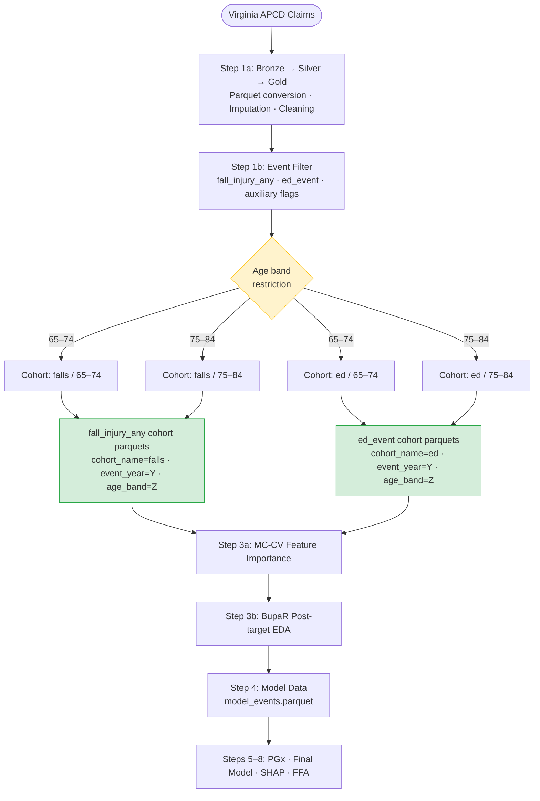

# Step 2: Cohort Creation

Creates the final analysis cohort with falls and ED visit targets.

## Cohort Definition

- **Index date**: First qualifying `fall_injury_any` event OR ED visit per patient per age band
- **Lookback**: 12 months of prior claims for feature engineering
- **Exclusions**: Patients with < 90 days of enrollment prior to index date
- **Age bands**: **65–74** and **75–84** only (falls risk is clinically concentrated in the 65–85 population)
- **Event years**: 2016, 2017, 2018, 2019

## Target Columns

### Primary outcomes
| Column | Definition |
|--------|------------|
| `fall_injury_any` | 1 if encounter has injury (S00–S99/T07/T14/T20–T34/T79) AND external cause (W00–W19) |
| `ed_event` | 1 if encounter is an ED visit (POS=23 or revenue code 045x/0981) |

### Auxiliary fall outcome flags
| Column | Definition |
|--------|------------|
| `fall_injury_serious` | `fall_injury_any = 1` AND any fracture code (T02, S12, S22, S32, S42, S52, S62, S72, S82, S92) |
| `fall_injury_head` | `fall_injury_any = 1` AND any head injury code S00–S09 |

### Key feature columns (NOT outcomes)
| Column | Note |
|--------|------|
| `r29_6_flag` | R29.6 (tendency to fall / repeated falls) — fall-risk feature, not outcome |
| `z91_81_flag` | Z91.81 (history of falling) — fall-risk feature, not outcome |

## Column Mapping from pgx-analysis
| Old (pgx-analysis) | New (cpic) |
|---|---|
| `opioid_ed_event` | `fall_injury_any` |
| `polypharmacy_ed_event` | `ed_event` |

## TODO
- [ ] Copy `0_create_cohort.py` from `pgx-analysis/2_create_cohort/`
- [ ] Update target columns: `fall_injury_any`, `fall_injury_serious`, `fall_injury_head`, `ed_event`
- [ ] Add feature columns: `r29_6_flag`, `z91_81_flag` (from Step 1b exclusion output)
- [ ] Copy `2_step2_data_quality_qa.py` and update outcome references
- [ ] Copy `3_cohort_final_metrics.py`
- [ ] Update `final_cohort_schema.json` with new target and auxiliary columns
- [x] **Age band restriction: 65–74 and 75–84 only** (falls risk is clinically concentrated in the 65–85 population)
- [ ] Run on EC2 (32-core/1TB instance for full Virginia APCD)
