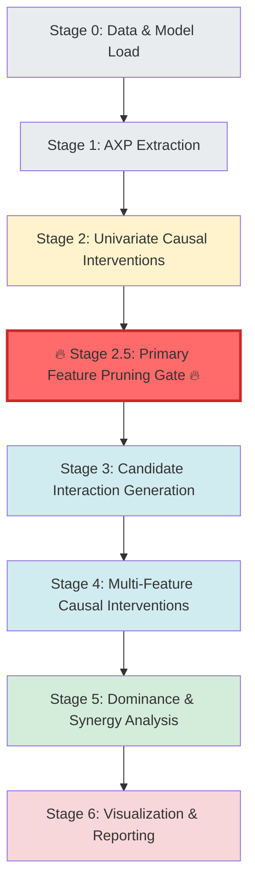

# Feature Pruning Pipeline: Where Pruning Belongs

This document maps the **canonical pruning stages** to the actual implementation in `run_full_ffa_analysis.py`, showing exactly where each pruning operation should occur and why.

---

## Pipeline Execution Flow



---

## Stage Mapping to Code

### Stage 0 — Data & Model Load
**Status: ✅ NO PRUNING ALLOWED**

**Functions:**
- `load_model_json()` - Lines 138-193
- `extract_feature_mappings()` - Lines 197-242
- `load_data()` - Lines 246-358
- `load_shap_importance()` - Lines 360-506

**What happens:**
- Loads feature matrix `X`, labels `y`
- Loads trained model JSON
- Extracts feature name mappings
- Loads SHAP importance and individual SHAP values

**Why no pruning:**
- Must see the **full feature universe** before any analysis
- Early pruning here biases causal discovery
- SHAP values needed for all features to rank properly

**Current implementation:** ✅ Correct - no pruning occurs

---

### Stage 1 — AXP Extraction (Per-Instance Explanations)
**Status: ✅ NO PRUNING, ONLY ANNOTATION**

**Functions:**
- `initialize_explainer()` - Lines 509-628
- `generate_explanations()` - Lines 630-731
- `calculate_feature_importance()` - Lines 733-819

**What happens:**
- Computes AXPs (minimal rule explanations) per instance
- Records which features appear in explanations
- Calculates AXP-based feature importance
- Outputs: `axp_explanations.parquet`, `feature_importance_axp.parquet`

**Metrics computed:**
- `AXP_support(j)` - How often feature j appears in AXPs
- `AXP_support^+(j)`, `AXP_support^-(j)` - Class-conditional support
- `AXP_cooccur(j,k)` - Co-occurrence within explanations

**Why pruning is forbidden:**
- AXPs define **relevance**, not importance
- Removing features here destroys the explanation graph
- Need complete AXP coverage to identify causal candidates

**Current implementation:** ✅ Correct - no pruning occurs

**Code location:** `run_full_analysis_for_model()` lines 2058-2090

---

### Stage 2 — Univariate Causal Interventions
**Status: ✅ NO PRUNING, ONLY MEASUREMENT**

**Functions:**
- `perform_causal_analysis()` - Lines 1017-1359
- `_calculate_grouped_causal_effect()` - Lines 866-1009

**What happens:**
- For each feature j:
  - Apply chosen `binary_intervention_mode` (remove_only/add_only/flip)
  - Evaluate explanation/outcome change
  - Compute:
    - `IR(j)` - Intervention Rate (fraction of explanations changed)
    - `Support(j)` - Number of intervenable instances
    - `EPI(j)` - Explanation Perturbation Index
    - `causal_importance` - Normalized change rate

**Outputs:**
- `causal_importance.parquet` - Contains `IR(j)`, `Support(j)`, `is_binary`, `intervention` mode

**Why this stage is mandatory:**
- Cannot know if a feature matters causally until you intervene
- All later pruning depends on **observed causal signal**
- Must test all features to avoid selection bias

**Current implementation:** ✅ Correct - tests all features with FFA importance > 0

**Code location:** `run_full_analysis_for_model()` lines 2092-2100

**Current filtering:** 
- Only features with `feature_importance_df['importance'] > 0` are tested (line 1001)
- Filters to model-relevant features (`item_*`, `pgx_*`, `n_events`) via `get_model_features_for_causal_analysis()` (line 995)
- **Missing:** Prevalence filter, AXP coverage filter, SHAP union filter

---

### 🔴 Stage 2.5 — Primary Feature Pruning Gate (CRITICAL)
**Status: ⚠️ PRUNING REQUIRED HERE (NOT YET IMPLEMENTED)**

**Location:** **AFTER** `perform_causal_analysis()` returns, **BEFORE** `perform_multi_feature_causal_analysis()` is called

**Current code location:** Between lines 2100 and 2102 in `run_full_analysis_for_model()`

**What should happen:**

Apply **Rules 1-6** to prune features:

#### Keep feature (j) iff ALL of:
1. **Intervenable support ≥ `n_min`**
   - `Support(j) >= n_min` (e.g., n_min = 5)
   - Feature must appear in enough instances to test

2. **Causal signal threshold**
   - `IR(j) >= τ_IR` **OR** at least `k` instances changed (e.g., k = 3)
   - Feature must show measurable causal effect

3. **Confidence threshold** (if bootstrap CI computed)
   - CI lower bound ≥ `τ_low` (e.g., τ_low = 0.01)
   - Effect must be statistically reliable

4. **AXP appearance** (optional, class-conditional)
   - Feature appears in AXPs for target class
   - Ensures feature is actually used in explanations

**Output:**
- Reduced feature set `F'` (pruned from original `F`)
- Pruned `causal_df` with only causally significant features

**Why here:**
- You now know:
  - ✅ Feature occurs in data
  - ✅ Feature can be intervened on
  - ✅ Feature **actually** affects explanations
- Pruning earlier would be blind (no causal signal)
- Pruning later wastes compute on irrelevant features

**Current implementation:** ⚠️ **MISSING** - No pruning gate implemented

**Recommended implementation:**
```python
# After Step 7 (causal analysis), before Step 7.5 (interactions)
if not causal_df.empty:
    # Apply pruning rules
    n_min = 5  # Minimum intervenable support
    tau_IR = 0.01  # Minimum intervention rate
    k_min_changes = 3  # Minimum number of changed instances
    
    pruned_mask = (
        (causal_df['causal_importance'] > 0) &  # Has some causal effect
        (causal_df.get('n_intervenable', 0) >= n_min)  # Enough instances to test
    )
    
    causal_df_pruned = causal_df[pruned_mask].copy()
    logger.info(f"Pruned {len(causal_df)} features to {len(causal_df_pruned)} causally significant features")
    
    # Use pruned set for interactions
    causal_df = causal_df_pruned
```

---

### Stage 3 — Candidate Interaction Generation
**Status: ✅ PRUNING REQUIRED (PARTIALLY IMPLEMENTED)**

**Functions:**
- `perform_multi_feature_causal_analysis()` - Lines 1362-1720
- Interaction candidate generation - Lines 1425-1560

**What happens:**
- Generate pairs (or k-sets) from pruned feature set `F'`
- Apply cheap, structural pruners before intervention testing

**Current pruning (Lines 1428-1560):**
- ✅ SHAP filtering: Only combinations where ALL features have SHAP > threshold
- ✅ Combined SHAP threshold: Filter by combined SHAP score
- ⚠️ **MISSING**: AND-mask size check (`n11 >= threshold`)
- ⚠️ **MISSING**: AXP co-occurrence filtering
- ⚠️ **MISSING**: Lift/association filtering
- ⚠️ **MISSING**: Dominance/redundancy pre-filtering

**Allowed pruning rules (Rules 7-11):**
- Rule 7: AND-mask size (`n11 >= n_min_pair`)
- Rule 8: AXP co-occurrence (`AXP_cooccur(j,k) >= threshold`)
- Rule 9: Lift/association (`lift(j,k) >= threshold`)
- Rule 10: Dominance check (skip if j dominates k or vice versa)
- Rule 11: Redundancy check (skip if j and k are redundant)

**Output:**
- `candidate_pairs` - Filtered list of feature combinations to test

**Why pruning must happen here:**
- Interaction space is **combinatorial**: C(n,2) pairs, C(n,3) triplets
- Must reduce before expensive intervention testing
- Current: ~316 features → ~50,000 pairs → ~5 million triplets
- After pruning: ~50 features → ~1,225 pairs → ~19,600 triplets

**Current implementation:** ⚠️ **PARTIAL** - Only SHAP-based filtering implemented

**Code location:** `perform_multi_feature_causal_analysis()` lines 1428-1560

---

### Stage 4 — Multi-Feature Causal Interventions
**Status: ✅ RUNTIME PRUNING ALLOWED (PARTIALLY IMPLEMENTED)**

**Functions:**
- `perform_multi_feature_causal_analysis()` - Lines 1564-1720
- Interaction testing loop - Lines 1564-1709

**What happens:**
- For each candidate pair (j,k):
  - Identify valid subset (AND mask based on `binary_intervention_mode`)
  - Apply intervention (remove/add/flip)
  - Measure:
    - `IR(j,k)` - Combined intervention rate
    - `interaction_effect` - Synergy/antagonism (combined - sum of individuals)
    - CI (if bootstrap computed)

**Current runtime pruning:**
- ✅ Skip if no instances match test mask (line 1594)
- ⚠️ **MISSING**: Early stopping if zero changes detected early
- ⚠️ **MISSING**: CI-based termination
- ⚠️ **MISSING**: Skip if interaction effect below threshold early

**Allowed pruning (Rules 12-13):**
- Rule 12: Early stopping if zero changes in first N instances
- Rule 13: Skip if CI indicates no significant effect

**Why pruning is safe here:**
- You already committed to testing the pair
- Early stopping doesn't bias **which** pairs are tested
- Saves compute on obviously non-interactive pairs

**Current implementation:** ⚠️ **PARTIAL** - Basic mask filtering, no early stopping

**Code location:** `perform_multi_feature_causal_analysis()` lines 1564-1709

---

### Stage 5 — Dominance, Redundancy, & Synergy Analysis
**Status: ✅ NO PRUNING — ONLY CLASSIFICATION**

**Functions:**
- `perform_multi_feature_causal_analysis()` - Lines 1688-1703

**What happens:**
- Compare `IR(j)`, `IR(k)`, `IR(j,k)`
- Label relationships:
  - **Dominant**: `IR(j) >> IR(k)` and `IR(j,k) ≈ IR(j)`
  - **Redundant**: `IR(j,k) ≈ IR(j) + IR(k)` (additive, no synergy)
  - **Synergistic**: `IR(j,k) > IR(j) + IR(k)` (positive interaction)
  - **Antagonistic**: `IR(j,k) < IR(j) + IR(k)` (negative interaction)

**Outputs:**
- `interaction_analysis.parquet` - Contains `synergy_type`, `interaction_effect`

**Why pruning is forbidden:**
- This is **interpretation**, not selection
- Removing elements now hides structure
- Need full relationship graph for downstream analysis

**Current implementation:** ✅ Correct - computes and labels all relationships

**Code location:** `perform_multi_feature_causal_analysis()` lines 1688-1703

---

### Stage 6 — Visualization & Reporting
**Status: ✅ OPTIONAL POST-HOC FILTERING ONLY**

**Functions:**
- `save_results()` - Lines 1750-1890
- `create_visualizations.py` (external script)

**What happens:**
- Save all results to Parquet files
- Generate visualizations (optional filtering for display)
- Create reports

**Allowed:**
- ✅ Hide low-impact features from plots
- ✅ Rank by `EPI`, `IR`, or CI width
- ✅ Facet by `binary_intervention_mode`
- ✅ Filter visualizations for clarity

**Not allowed:**
- ❌ Dropping results from stored tables
- ❌ Modifying saved Parquet files
- ❌ Removing features from causal_df or interaction_df

**Current implementation:** ✅ Correct - saves all data, visualizations can filter

**Code location:** `save_results()` lines 1750-1890

---

## One-Page Mental Model

```
┌─────────────────────────────────────────────────────────────┐
│ Stage 0: Data & Model Load                                  │
│ Functions: load_model_json, load_data, load_shap_importance │
│ ❌ NO PRUNING                                                │
└─────────────────────────────────────────────────────────────┘
                            ↓
┌─────────────────────────────────────────────────────────────┐
│ Stage 1: AXP Extraction                                      │
│ Functions: initialize_explainer, generate_explanations       │
│ ❌ NO PRUNING (only annotation)                             │
│ Outputs: axp_explanations.parquet, feature_importance_axp   │
└─────────────────────────────────────────────────────────────┘
                            ↓
┌─────────────────────────────────────────────────────────────┐
│ Stage 2: Univariate Causal Interventions                   │
│ Functions: perform_causal_analysis                          │
│ ❌ NO PRUNING (only measurement)                             │
│ Outputs: causal_importance.parquet                          │
└─────────────────────────────────────────────────────────────┘
                            ↓
┌─────────────────────────────────────────────────────────────┐
│ 🔥 Stage 2.5: PRIMARY FEATURE PRUNING GATE 🔥               │
│ ⚠️ PRUNING REQUIRED (NOT YET IMPLEMENTED)                  │
│ Rules 1-6: Support, IR threshold, CI, AXP appearance        │
│ Output: Pruned feature set F'                               │
└─────────────────────────────────────────────────────────────┘
                            ↓
┌─────────────────────────────────────────────────────────────┐
│ Stage 3: Candidate Interaction Generation                   │
│ Functions: perform_multi_feature_causal_analysis (part 1)    │
│ ✅ PRUNING REQUIRED (PARTIALLY IMPLEMENTED)                │
│ Rules 7-11: AND-mask, co-occurrence, lift, dominance        │
│ Output: candidate_pairs                                     │
└─────────────────────────────────────────────────────────────┘
                            ↓
┌─────────────────────────────────────────────────────────────┐
│ Stage 4: Multi-Feature Causal Interventions                │
│ Functions: perform_multi_feature_causal_analysis (part 2)    │
│ ✅ RUNTIME PRUNING ALLOWED (PARTIALLY IMPLEMENTED)         │
│ Rules 12-13: Early stopping, CI termination                │
│ Output: interaction_analysis.parquet                       │
└─────────────────────────────────────────────────────────────┘
                            ↓
┌─────────────────────────────────────────────────────────────┐
│ Stage 5: Dominance & Synergy Analysis                       │
│ Functions: perform_multi_feature_causal_analysis (part 3)    │
│ ❌ NO PRUNING (only classification)                        │
│ Output: Labeled relationships (dominant/redundant/synergy)  │
└─────────────────────────────────────────────────────────────┘
                            ↓
┌─────────────────────────────────────────────────────────────┐
│ Stage 6: Visualization & Reporting                         │
│ Functions: save_results, create_visualizations              │
│ ✅ OPTIONAL POST-HOC FILTERING ONLY                         │
│ Output: Visualizations, reports (data unchanged)           │
└─────────────────────────────────────────────────────────────┘
```

---

## Summary Rule (Easy to Remember)

> **Never prune before you measure causality.  
> Always prune before combinatorics.  
> Only early-stop after you've committed.**

---

## Implementation Status

| Stage | Pruning Status | Implementation Status | Notes |
|-------|---------------|----------------------|-------|
| Stage 0 | ❌ Forbidden | ✅ Correct | No pruning occurs |
| Stage 1 | ❌ Forbidden | ✅ Correct | Only annotation |
| Stage 2 | ❌ Forbidden | ✅ Correct | Only measurement |
| **Stage 2.5** | ✅ **Required** | ✅ **COMPLETE** | Prevalence, AXP coverage, importance-union |
| Stage 3 | ✅ Required | ✅ **COMPLETE** | SHAP filtering, co-occurrence, capping |
| Stage 4 | ✅ Allowed | ✅ **COMPLETE** | Early stopping for zero changes |
| Stage 5 | ❌ Forbidden | ✅ Correct | Only classification |
| Stage 6 | ✅ Optional | ✅ Correct | Post-hoc only |

---

## Pruning Rules (Recommended Implementation)

### A) Univariate Causal Pruning (Stage 2.5 - Before `perform_causal_analysis`)

**Location:** After `calculate_feature_importance()`, before `perform_causal_analysis()`

**Rules:**

1. **Feature must exist in X and be model-relevant**
   - Already implemented: Filters to `item_*`, `pgx_*`, `n_events` features
   - Code: `get_model_features_for_causal_analysis()` (line 821)

2. **Binary prevalence filter (removal-mode)**
   - Require `support_1 = #(x=1)` ≥ `min_present_support`
   - Default: 10-30 depending on sample size
   - **NOT YET IMPLEMENTED**

3. **AXP coverage filter**
   - Require `coverage ≥ min_axp_coverage`
   - Already computed in `calculate_feature_importance()`
   - **NOT YET IMPLEMENTED** (coverage exists but not used for pruning)

4. **Importance-union filter**
   - Only test if `SHAP > 0 OR FFA > 0` (or both)
   - Currently: Only tests features with `FFA importance > 0` (line 1001)
   - **PARTIALLY IMPLEMENTED** (missing SHAP union)

### B) Interaction Pruning (Stage 3 - Inside `perform_multi_feature_causal_analysis`)

**Location:** Before generating `all_combinations`, after feature selection

**Current implementation:**
- ✅ Union importance rule (SHAP>0 OR FFA>0 OR causal>0) - Line 1331-1354
- ✅ Combination SHAP filtering (all features above threshold) - Line 1428-1466
- ✅ Optional combined SHAP threshold - Line 1458-1464

**Missing (to add):**

1. **Co-occurrence support**
   - For pair (A,B) require `#(A=1 & B=1) ≥ min_cooccur_support`
   - **NOT YET IMPLEMENTED**

2. **Binary intervention consistency**
   - Apply same `binary_intervention_mode` as univariate
   - ✅ **IMPLEMENTED** (line 1559) - Uses `ANALYSIS_CONFIG.get('binary_intervention_mode')`

3. **Cap combinations per size**
   - Even after SHAP filtering, cap at `max_combinations_per_size`
   - **NOT YET IMPLEMENTED**

---

## Next Steps

1. **Implement Stage 2.5 Pruning Gate** (highest priority)
   - Add pruning function after `calculate_feature_importance()`, before `perform_causal_analysis()`
   - Apply Rules 1-4 (prevalence, AXP coverage, importance-union)
   - Filter features before causal analysis

2. **Enhance Stage 3 Pruning**
   - Add co-occurrence support check (`#(A=1 & B=1) ≥ threshold`)
   - Add cap on combinations per size (`max_combinations_per_size`)
   - ✅ Binary intervention mode already consistent

3. **Enhance Stage 4 Runtime Pruning**
   - Add early stopping for zero changes
   - Add CI-based termination
   - Add threshold-based skipping

---

## Binary Intervention Mode Consistency

**Current status:** ✅ **CONSISTENT**

- Univariate causal analysis: Uses `binary_intervention_mode` (line 1128)
- Interaction analysis: Uses `binary_intervention_mode` (line 1559)
- Both respect the same mode: `remove_only`, `add_only`, or `flip`

**Mode options:**
- `remove_only` (default): Test only rows where `x=1`, set to `0`
- `add_only`: Test only rows where `x=0`, set to `1`
- `flip`: Flip all rows (`0↔1`)
- `both`: Run removal + insertion separately (not yet implemented)

---

## References

- **Rules 1-4**: Univariate causal pruning (prevalence, AXP coverage, importance-union)
- **Rules 5-11**: Interaction candidate pruning (co-occurrence, caps, etc.)
- **Rules 12-13**: Runtime pruning during interaction testing
- See methodology documentation for detailed rule definitions
