# Feature Pruning Pipeline: Visual Diagram

## Complete Pipeline Flow

```mermaid
flowchart TD
    Start([Start: run_full_analysis_for_model]) --> Stage0[Stage 0: Data & Model Load]
    
    Stage0 --> Stage0_Func1[load_model_json<br/>Lines 138-193]
    Stage0 --> Stage0_Func2[extract_feature_mappings<br/>Lines 197-242]
    Stage0 --> Stage0_Func3[load_data<br/>Lines 246-358]
    Stage0 --> Stage0_Func4[load_shap_importance<br/>Lines 360-506]
    
    Stage0_Func1 & Stage0_Func2 & Stage0_Func3 & Stage0_Func4 --> Stage0_Note[❌ NO PRUNING<br/>Must see full feature universe]
    
    Stage0_Note --> Stage1[Stage 1: AXP Extraction]
    
    Stage1 --> Stage1_Func1[initialize_explainer<br/>Lines 509-628]
    Stage1 --> Stage1_Func2[generate_explanations<br/>Lines 630-731]
    Stage1 --> Stage1_Func3[calculate_feature_importance<br/>Lines 733-819]
    
    Stage1_Func1 & Stage1_Func2 & Stage1_Func3 --> Stage1_Note[❌ NO PRUNING<br/>Only annotation<br/>Output: axp_explanations.parquet]
    
    Stage1_Note --> Stage2[Stage 2: Univariate Causal Interventions]
    
    Stage2 --> Stage2_Func1[perform_causal_analysis<br/>Lines 1017-1359]
    Stage2_Func1 --> Stage2_Func2[_calculate_grouped_causal_effect<br/>Lines 866-1009]
    
    Stage2_Func2 --> Stage2_Note[❌ NO PRUNING<br/>Only measurement<br/>Output: causal_importance.parquet]
    
    Stage2_Note --> Stage25[🔥 Stage 2.5: PRIMARY PRUNING GATE 🔥]
    
    Stage25 --> Stage25_Rules[Apply Rules 1-6:<br/>• Support ≥ n_min<br/>• IR ≥ τ_IR OR k changes<br/>• CI lower bound ≥ τ_low<br/>• AXP appearance]
    
    Stage25_Rules --> Stage25_Note[⚠️ NOT YET IMPLEMENTED<br/>Location: After line 2100<br/>Output: Pruned feature set F']
    
    Stage25_Note --> Stage3[Stage 3: Candidate Interaction Generation]
    
    Stage3 --> Stage3_Func1[perform_multi_feature_causal_analysis<br/>Lines 1362-1720<br/>Part 1: Generation]
    
    Stage3_Func1 --> Stage3_Rules[Apply Rules 7-11:<br/>• AND-mask size<br/>• AXP co-occurrence<br/>• Lift/association<br/>• Dominance check<br/>• Redundancy check]
    
    Stage3_Rules --> Stage3_Note[⚠️ PARTIALLY IMPLEMENTED<br/>Only SHAP filtering done<br/>Output: candidate_pairs]
    
    Stage3_Note --> Stage4[Stage 4: Multi-Feature Causal Interventions]
    
    Stage4 --> Stage4_Func1[perform_multi_feature_causal_analysis<br/>Lines 1564-1709<br/>Part 2: Testing]
    
    Stage4_Func1 --> Stage4_Rules[Apply Rules 12-13:<br/>• Early stopping<br/>• CI termination]
    
    Stage4_Rules --> Stage4_Note[⚠️ PARTIALLY IMPLEMENTED<br/>Basic mask filtering only<br/>Output: interaction_analysis.parquet]
    
    Stage4_Note --> Stage5[Stage 5: Dominance & Synergy Analysis]
    
    Stage5 --> Stage5_Func1[perform_multi_feature_causal_analysis<br/>Lines 1688-1703<br/>Part 3: Classification]
    
    Stage5_Func1 --> Stage5_Note[❌ NO PRUNING<br/>Only classification<br/>Label: dominant/redundant/synergy]
    
    Stage5_Note --> Stage6[Stage 6: Visualization & Reporting]
    
    Stage6 --> Stage6_Func1[save_results<br/>Lines 1750-1890]
    Stage6 --> Stage6_Func2[create_visualizations.py<br/>External script]
    
    Stage6_Func1 & Stage6_Func2 --> Stage6_Note[✅ OPTIONAL POST-HOC FILTERING<br/>Visualizations can filter<br/>Data files unchanged]
    
    Stage6_Note --> End([End])
    
    style Stage25 fill:#ff6b6b,stroke:#c92a2a,stroke-width:3px
    style Stage25_Note fill:#ff6b6b,stroke:#c92a2a,stroke-width:2px
    style Stage0 fill:#e9ecef
    style Stage1 fill:#e9ecef
    style Stage2 fill:#fff3cd
    style Stage3 fill:#d1ecf1
    style Stage4 fill:#d1ecf1
    style Stage5 fill:#d4edda
    style Stage6 fill:#f8d7da
```



---

## Code Location Map

| Stage | Function | File | Lines | Pruning Status |
|-------|----------|------|-------|----------------|
| **Stage 0** | `load_model_json()` | `run_full_ffa_analysis.py` | 138-193 | ❌ Forbidden |
| **Stage 0** | `extract_feature_mappings()` | `run_full_ffa_analysis.py` | 197-242 | ❌ Forbidden |
| **Stage 0** | `load_data()` | `run_full_ffa_analysis.py` | 246-358 | ❌ Forbidden |
| **Stage 0** | `load_shap_importance()` | `run_full_ffa_analysis.py` | 360-506 | ❌ Forbidden |
| **Stage 1** | `initialize_explainer()` | `run_full_ffa_analysis.py` | 509-628 | ❌ Forbidden |
| **Stage 1** | `generate_explanations()` | `run_full_ffa_analysis.py` | 630-731 | ❌ Forbidden |
| **Stage 1** | `calculate_feature_importance()` | `run_full_ffa_analysis.py` | 733-819 | ❌ Forbidden |
| **Stage 2** | `perform_causal_analysis()` | `run_full_ffa_analysis.py` | 1017-1359 | ❌ Forbidden |
| **Stage 2** | `_calculate_grouped_causal_effect()` | `run_full_ffa_analysis.py` | 866-1009 | ❌ Forbidden |
| **Stage 2.5** | **MISSING** | `run_full_analysis_for_model()` | **After 2100** | ⚠️ **REQUIRED** |
| **Stage 3** | `perform_multi_feature_causal_analysis()` (part 1) | `run_full_ffa_analysis.py` | 1425-1560 | ⚠️ Partial |
| **Stage 4** | `perform_multi_feature_causal_analysis()` (part 2) | `run_full_ffa_analysis.py` | 1564-1709 | ⚠️ Partial |
| **Stage 5** | `perform_multi_feature_causal_analysis()` (part 3) | `run_full_ffa_analysis.py` | 1688-1703 | ❌ Forbidden |
| **Stage 6** | `save_results()` | `run_full_ffa_analysis.py` | 1750-1890 | ✅ Optional |

---

## Execution Order in `run_full_analysis_for_model()`

```python
# Line 1961: Step 1 - Load model
model_json = load_model_json(model_json_path)  # Stage 0

# Line 1966: Step 2 - Extract feature mappings
feature_mappings = extract_feature_mappings(model_json)  # Stage 0

# Line 1970: Step 3 - Load data
X, y = load_data(DATA_PATH)  # Stage 0

# Line 2027: Step 3.5 - Load SHAP
shap_map, shap_values_df = load_shap_importance(...)  # Stage 0

# Line 2059: Step 4 - Initialize explainer
explainer = initialize_explainer(...)  # Stage 1

# Line 2080: Step 5 - Generate explanations
df_axps = generate_explanations(explainer, X, y)  # Stage 1

# Line 2089: Step 6 - Calculate feature importance
feature_importance_df = calculate_feature_importance(df_axps)  # Stage 1

# Line 2093: Step 7 - Perform causal analysis
causal_df = perform_causal_analysis(...)  # Stage 2

# 🔥 INSERT STAGE 2.5 PRUNING HERE 🔥
# After line 2100, before line 2102
# causal_df = prune_features(causal_df, rules_1_6)

# Line 2105: Step 7.5 - Multi-feature interactions
interaction_df = perform_multi_feature_causal_analysis(...)  # Stages 3-5

# Line 2117: Step 8 - Save results
save_results(...)  # Stage 6
```

---

## Pruning Rules Summary

### Rules 1-6: Primary Feature Pruning (Stage 2.5)
**Location:** After `perform_causal_analysis()`, before `perform_multi_feature_causal_analysis()`

1. **Intervenable support ≥ n_min**
2. **IR(j) ≥ τ_IR OR k instances changed**
3. **CI lower bound ≥ τ_low** (if bootstrap computed)
4. **Appears in AXPs** (optionally class-conditional)

### Rules 7-11: Interaction Candidate Pruning (Stage 3)
**Location:** Inside `perform_multi_feature_causal_analysis()`, before intervention testing

7. **AND-mask size** (`n11 >= n_min_pair`)
8. **AXP co-occurrence** (`AXP_cooccur(j,k) >= threshold`)
9. **Lift/association** (`lift(j,k) >= threshold`)
10. **Dominance check** (skip if j dominates k)
11. **Redundancy check** (skip if j and k redundant)

### Rules 12-13: Runtime Pruning (Stage 4)
**Location:** Inside `perform_multi_feature_causal_analysis()`, during intervention testing

12. **Early stopping** (if zero changes in first N instances)
13. **CI termination** (skip if CI indicates no effect)

---

## Implementation Checklist

- [x] Stage 0: No pruning (correct)
- [x] Stage 1: No pruning (correct)
- [x] Stage 2: No pruning (correct)
- [ ] **Stage 2.5: Primary pruning gate (CRITICAL - NOT IMPLEMENTED)**
- [ ] Stage 3: Full candidate pruning (PARTIAL - only SHAP filtering)
- [ ] Stage 4: Runtime pruning (PARTIAL - basic mask filtering)
- [x] Stage 5: No pruning (correct)
- [x] Stage 6: Optional filtering (correct)
