# CPIC Time-to-Event Analysis: Falls and ED Visit Risk Prediction

End-to-end machine learning pipeline predicting **fall-related** and **ED visit** events from APCD claims data — from cohort creation through ensemble model training, causal feature attribution, temporal trajectory analysis, and process mining.

**Combines XGBoost/CatBoost ensemble modeling, SHAP analysis, Formal Feature Attribution (FFA), Dynamic Time Warping (DTW) trajectory clustering, FP-Growth pattern mining, and BupaR process mining on large-scale healthcare claims data (Virginia APCD). CPIC pharmacogenomic features are incorporated as causal inputs to explain drug and gene-drug interaction contributions to fall and ED event risk.**

---

## 🎯 Target Outcomes

### 1. Fall Events

Outcome label: **`fall_injury_any = 1`** when **both** criteria are present on the same encounter:

#### Criterion 1 — Injury diagnosis (any of the following ICD-10-CM codes):
| Range | Description |
|-------|-------------|
| S00–S99 | Injuries to specific body regions (head, neck, thorax, abdomen, extremities, etc.) |
| T07 | Unspecified multiple injuries |
| T14 | Injury of unspecified body region |
| T20–T32 | Burns and corrosions |
| T33–T34 | Frostbite |
| T79 | Certain early complications of trauma (traumatic shock, compartment syndrome) |

#### Criterion 2 — External cause fall code (any of the following ICD-10-CM codes):
| Range | Description |
|-------|-------------|
| W00–W19 | Fall-mechanism external cause codes (fall on ice, same-level fall, fall from bed/stairs/ladder, unspecified fall, etc.) |

> **Implementation rule:** an encounter must satisfy **both** criteria (injury + fall external cause) to be labeled `fall_injury_any = 1`.

#### Optional incident-only filter:
- Restrict to diagnosis codes with **7th character = `A`** (initial encounter); exclude `D` (subsequent) and `S` (sequela).

**Exclusions (outcome side — treat these as features, not outcomes):**
- `R29.6` — Tendency to fall / repeated falls (risk feature, not an injury event)
- `Z91.81` — History of falling (personal history / administrative code, not an acute event)
- CPT `1100F` — Falls risk screening (process measure, not a fall event)
- `T80–T88` — Complications of surgical/medical care (iatrogenic, not mechanical fall injury)

#### Auxiliary outcome flags:
| Flag | Definition |
|------|------------|
| `fall_injury_any` | Injury (S00–T79 subset) + W00–W19 on same encounter |
| `fall_injury_serious` | `fall_injury_any = 1` AND any fracture code: T02.\*, S12.\*, S22.\*, S32.\*, S42.\*, S52.\*, S62.\*, S72.\*, S82.\*, S92.\* |
| `fall_injury_head` | `fall_injury_any = 1` AND any head injury code S00–S09 |

### 2. ED Visits
Same logic as `pgx-analysis` event filter — emergency department claim classification via place of service (POS=23) and revenue codes.

---

## 🗂️ Folder Structure

```
cpic_time_to_event_analysis/
│
├── 1a_apcd_input_data/        # Step 1a: Raw APCD → Parquet; imputation; cleaning
├── 1b_apcd_event_filter/      # Step 1b: ICD/CPT event filter (falls + ED logic)
├── 2_create_cohort/           # Step 2:  Cohort creation, QA, final schema
│
├── 3a_feature_importance/     # Step 3a: Monte Carlo CV feature importance screening
├── 3b_feature_importance_eda/ # Step 3b: Post-target BupaR + EDA
│
├── 4_model_data/              # Step 4:  Feature-engineered model datasets
├── 5_pgx_analysis/            # Step 5:  CPIC/PGx feature enrichment
│
├── 6_final_model/             # Step 6:  XGBoost/CatBoost training (per n_event_bin)
├── 7_shap_analysis/           # Step 7:  SHAP analysis
├── 8_ffa_analysis/            # Step 8:  FFA + DTW + FP-Growth + BupaR
│
├── py_helpers/                # Shared Python utilities (adapted from pgx-analysis)
├── r_helpers/                 # Shared R utilities (BupaR, DTW, MC-CV)
│
├── docs/                      # Analysis documentation and methodology notes
├── data/                      # Local data (gitignored)
├── logs/                      # Pipeline logs (gitignored)
├── secrets/                   # AWS credentials etc. (gitignored)
├── status/                    # Pipeline status/checkpoints
└── utility_scripts/           # Misc operational scripts
```

---

## � Pipeline Overview

```mermaid
flowchart LR
    subgraph INPUT["Data Inputs"]
        A([Virginia APCD Claims])
    end

    subgraph PREP["Steps 1a–1b: Prepare"]
        B[1a: Bronze → Silver → Gold\nParquet · Imputation · Cleaning]
        C[1b: Event Filter\nfall_injury_any · ed_event\nW00–W19 + S00–S99]
    end

    subgraph COHORT["Step 2: Cohorts\n(Age bands: 65–74, 75–84 only)"]
        D1[falls cohort\nfall_injury_any = 1]
        D2[ed cohort\ned_event = 1]
    end

    subgraph FI["Steps 3a–3b: Feature Importance"]
        E[3a: MC-CV\nCatBoost · XGBoost · XGBoostRF]
        F[3b: BupaR post-target\nleakage removal]
    end

    subgraph MODEL["Steps 4–8: Model Pipeline"]
        G[4: Model Data\nmodel_events.parquet]
        H[5: PGx Enrichment\nCPIC drug features]
        I[6: Final Model\nXGBoost · CatBoost per bin]
        J[7: SHAP Analysis]
        K[8: FFA · DTW · FP-Growth · BupaR]
    end

    A --> B --> C --> D1 & D2
    D1 & D2 --> E --> F --> G --> H --> I --> J --> K

    style INPUT fill:#e8f4fd,stroke:#1a73e8
    style COHORT fill:#fff3cd,stroke:#ffc107
    style MODEL fill:#d4edda,stroke:#28a745
```



---

## � Workflow Notebooks (TODO — run in order)

| # | Notebook | Purpose | Steps |
|---|----------|---------|-------|
| 0 | `0_config_and_pipeline.ipynb` | Configure EC2/local setup, S3 paths, cohort parameters | Config |
| 1 | `1_cohort_workflow.ipynb` | Cohort creation (APCD input, event filtering, QA) | 1a → 1b → 2 |
| 2 | `2_feature_importance.ipynb` | Feature importance screening and refinement | 3a → 3b |
| 3 | `3_model_train_shap_ffa.ipynb` | Model training, SHAP, FFA, DTW, BupaR | 6 → 7 → 8 |

---

## ✅ TODO — Implementation Checklist

### Step 1a: APCD Input Data
- [ ] Copy and adapt `1a_apcd_input_data/0_txt_to_parquet.py` from pgx-analysis
- [ ] Copy and adapt `1a_apcd_input_data/2_global_imputation.py`
- [ ] Copy and adapt `1a_apcd_input_data/3_apcd_clean.py`, `3a_clean_pharmacy.py`, `3b_clean_medical.py`
- [ ] Update S3 bucket/prefix paths in `py_helpers/constants.py`
- [ ] Update `1a_apcd_input_data/6_target_frequency_analysis.py` for falls codes

### Step 1b: Event Filter
- [ ] Copy `1b_apcd_event_filter/filter_protocol_events.py` from pgx-analysis
- [ ] **Update target outcome logic**: implement two-criterion `fall_injury_any` label (injury S00–S99/T07/T14/T20–T34/T79 AND external cause W00–W19 on same encounter)
- [ ] **Add exclusion filter**: remove events where ICD = `Z91.81` OR CPT = `1100F` OR ICD = `R29.6` (move R29.6 to feature)
- [ ] **Compute auxiliary flags**: `fall_injury_serious` (+ fracture codes) and `fall_injury_head` (+ S00–S09)
- [ ] Update `administrative_codes_lookup.json` — add falls-specific admin exclusions
- [ ] Keep ED visit logic intact (POS=23 + revenue code filter)
- [ ] Update README with new code classification rationale

### Step 2: Cohort Creation
- [ ] Copy `2_create_cohort/0_create_cohort.py` from pgx-analysis
- [ ] Update cohort definition: target = falls OR ED visit (binary per outcome)
- [x] **Age band restriction: 65–74 and 75–84 only** (falls risk is clinically concentrated in the 65–85 population)
- [ ] Copy and adapt QA scripts (`2_step2_data_quality_qa.py`, `3_cohort_final_metrics.py`)
- [ ] Update `final_cohort_schema.json` for new target columns
- [ ] Run cohort creation on EC2 (see `README_ec2_32core_1tb_cohort_runs.md` in pgx-analysis)

### Step 3a: Feature Importance (Monte Carlo CV)
- [ ] Copy `3a_feature_importance/run_mc_feature_importance.py` from pgx-analysis
- [ ] Copy cohort runner scripts (`run_cohort_*.py`) and update S3 paths
- [ ] Update target variable references: `falls_event` / `ed_event`
- [ ] Validate top feature sets for both outcomes separately

### Step 3b: Feature Importance EDA
- [ ] Copy BupaR post-target analysis scripts from pgx-analysis `3b_feature_importance_eda/`
- [ ] Update target codes for falls-specific process sequences

### Step 4: Model Data
- [ ] Copy `4_model_data/` build scripts from pgx-analysis
- [ ] Build feature-engineered parquet datasets for falls and ED outcomes separately
- [ ] Update `event_density_utils.py` thresholds for falls outcome (n_event_bin)

### Step 5: CPIC/PGx Analysis
- [ ] Copy `5_pgx_analysis/` scripts from pgx-analysis
- [ ] Identify CPIC-relevant drugs for falls risk (CNS depressants, psychotropics, anticoagulants)
- [ ] Update drug-CPIC mappings for falls-relevant pharmacogenomic categories
- [ ] Cross-reference fall-risk medications with CPIC guidelines (CYP2D6, CYP3A4-metabolized drugs)

### Step 6: Final Model Training
- [ ] Copy `6_final_model/run_final_model.py` from pgx-analysis
- [ ] Copy `6_final_model/build_final_cohort_model_features.py`
- [ ] Train **per-bin models** (XGBoost + CatBoost) for falls outcome per age band
- [ ] Train **per-bin models** for ED outcome per age band
- [ ] Run Optuna hyperparameter optimization per bin
- [ ] Update S3 output paths: `gold/final_model/falls/` and `gold/final_model/ed/`

### Step 7: SHAP Analysis
- [ ] Copy `7_shap_analysis/` scripts from pgx-analysis
- [ ] Generate SHAP values for falls models and ED models
- [ ] Compare SHAP profiles: which features differ between falls vs. ED risk?

### Step 8: FFA + DTW + FP-Growth + BupaR
- [ ] Copy core FFA scripts from `8_ffa_analysis/`:
  - `ffa_analysis.py`, `catboost_axp_explainer.py`, `xgboost_axp_explainer.py`
  - `combined_causal_analysis.py`, `create_visualizations.py`
- [ ] **DTW**: apply `dtaidistance` trajectory clustering to falls event sequences
  - Research question: Do temporal medication sequences predict fall timing?
- [ ] **BupaR**: run process mining on pre-fall clinical sequences
  - Research question: What care pathways precede falls?
- [ ] **FP-Growth**: mine frequent drug combinations in fall-risk patients
  - Focus: polypharmacy patterns involving fall-risk medications (sedatives, antihypertensives, etc.)
- [ ] Update `8_ffa_analysis/ffa_utils.py` target variable references

### py_helpers Adaptations
- [ ] Copy all files from `pgx-analysis/py_helpers/` as baseline
- [ ] Update `constants.py`: new S3 paths, cohort names, target variables
- [ ] Update `event_density_utils.py`: recalculate n_event_bin thresholds for falls population
- [ ] Update `cohort_utils.py`: target column names
- [ ] Update `data_utils.py`: any outcome-specific transformations
- [ ] Keep `aws_utils.py`, `s3_utils.py`, `logging_utils.py`, `checkpoint_utils.py` unchanged

### r_helpers Adaptations
- [ ] Copy all files from `pgx-analysis/r_helpers/` as baseline
- [ ] Update `constants.R`: target variable names
- [ ] Update `run_cohort_analysis.R`: falls/ED target columns
- [ ] Keep MC-CV, BupaR, and DTW logic intact

### Notebook Adaptations ✅ COMPLETE
- [x] `0_config_and_pipeline.ipynb`
  - [x] Update `PROJECT_OUTPUT_DIRS`: `cohort_name=falls` / `cohort_name=ed`; removed `10_risk_dashboard/outputs`
  - [x] Update pipeline run guide cell: cohort names, removed Steps 9–10
  - [x] Remove Docker / ECR / API Gateway cells
  - [x] Update S3 checkpoint bucket/prefix to cpic project values
- [x] `1_cohort_workflow.ipynb`
  - [x] Update cohort series markdown: OPIOID_ED → FALLS, POLYPHARMACY → ED
  - [x] Update script references: `run_series_falls.py`, `run_series_ed.py`
  - [x] Update cohort table: target column `fall_injury_any` / `ed_event`
- [x] `2_feature_importance.ipynb` — cohort names, targets, age bands 65-74/75-84, S3 bucket var
- [x] `3_model_train_shap_ffa.ipynb` — cohort names, S3 paths, removed dashboard cells
- [x] `2_create_cohort/cohort_workflow.ipynb` — cohort names, age bands 65-74/75-84, mermaid diagram
- [x] `3a_feature_importance/feature_importance_cohort_runner.ipynb` — falls/ed targets, 65-74/75-84 only, replaced R code cells
- [x] `3b_feature_importance_eda/step3b_interactive_analysis_cohort1.ipynb` → falls / 65–74
- [x] `3b_feature_importance_eda/step3b_interactive_analysis_cohort2.ipynb` → falls / 75–84
- [x] `3b_feature_importance_eda/step3b_interactive_analysis_cohort3.ipynb` → ed / 65–74
- [x] `3b_feature_importance_eda/step3b_interactive_analysis_cohort4.ipynb` → ed / 75–84
- [x] `3b_feature_importance_eda/step3b_interactive_analysis_cohort5-7.ipynb` → marked SUPERSEDED (delete)
- [x] `5_pgx_analysis/pgx_cohort_runner.ipynb` — falls/ed cohorts, 65-74/75-84, fixed project root
- [x] `6_final_model/build_train_test_datasets.ipynb` — cohort names, 65-74/75-84, target columns
- [x] `6_final_model/final_model_cohort_runner.ipynb` — falls/ed, 65-74/75-84, fixed project root
- [x] `7_shap_analysis/shap_cohort_runner.ipynb` — falls/ed, 65-74/75-84, fixed project root

---

## 🔬 Research Questions (DTW / BupaR)

1. **What temporal medication sequences (DTW clusters) are most predictive of fall events?**
2. **Which drug-drug interaction patterns (FP-Growth rules) co-occur in high-fall-risk patients?**
3. **What clinical care pathways (BupaR process maps) precede a fall ED visit vs. non-fall ED visit?**
4. **Do CPIC pharmacogenomic actionability levels modulate fall risk independent of polypharmacy burden?**
5. **Does the temporal gap between a high-risk medication prescription and a fall follow a predictable pattern (DTW alignment)?**

---

## 🏗️ Infrastructure

- **Compute**: AWS EC2 (cohort + model training)
- **Storage**: AWS S3 (all intermediate and final outputs)
- **Checkpointing**: S3-based idempotent pipeline (same as pgx-analysis)
- **Environment**: Python 3.11 + R 4.x

### S3 Paths (TODO — update in `py_helpers/constants.py`)
```
Bronze: s3://<bucket>/bronze/cpic_falls/
Silver: s3://<bucket>/silver/cpic_falls/
Gold:   s3://<bucket>/gold/cpic_falls/final_model/
```

---

## 📦 Differences from pgx-analysis

| Aspect | pgx-analysis | cpic_time_to_event_analysis |
|--------|-------------|----------------------------|
| Target 1 | Opioid-related ED visit | **Falls** (`fall_injury_any`: injury S00–S99/T07/T14/T20–T34/T79 + external cause W00–W19) |
| Target 2 | Polypharmacy/geriatric ED visit | **ED visit** (same logic) |
| **Age bands** | Full set (0–12 through 85–114) | **65–74 and 75–84 only** (falls risk is clinically concentrated in the 65–85 population) |
| Exclusions | Admin codes only | + Z91.81 (fall history) + CPT 1100F + R29.6 (moved to feature) + T80–T88 (surgical complications) |
| PGx focus | Opioid metabolism (CYP2D6, CYP3A4) | Fall-risk drugs (CNS, antihypertensives, psychotropics) |
| Dashboard | Yes (serverless Lambda) | No (analysis only) |
| Manuscript | CTS submission | TBD |

---

## ⚙️ Quick Start

```bash
# Install dependencies
pip install -r requirements.txt

# Configure AWS credentials
aws configure --profile cpic

# Clone and initialize
git clone https://github.com/Jerome3590/cpic_time_to_event_analysis.git
cd cpic_time_to_event_analysis
```

---

*Analysis by R. Jerome Dixon — VCU School of Pharmacy, Dept. of Pharmacotherapy and Outcomes Science*
