# CPIC Time-to-Event Analysis: Falls and ED Visit Risk Prediction

End-to-end machine learning pipeline predicting **fall-related** and **ED visit** events from APCD claims data — from cohort creation through ensemble model training, causal feature attribution, temporal trajectory analysis, and process mining.

**Combines XGBoost/CatBoost ensemble modeling, SHAP analysis, Formal Feature Attribution (FFA), Dynamic Time Warping (DTW) trajectory clustering, FP-Growth pattern mining, and BupaR process mining on large-scale healthcare claims data (Virginia APCD). CPIC pharmacogenomic features are incorporated as causal inputs to explain drug and gene-drug interaction contributions to fall and ED event risk.**

---

## 🎯 Target Outcomes

### 1. Fall Events

Outcome label: **`fall_injury_any = 1`** when **both** criteria are present on the same encounter:

#### Criterion 1 — Injury diagnosis (any of the following ICD-10-CM codes):
| Range | Description |
|-------|-------------|
| S00–S99 | Injuries to specific body regions (head, neck, thorax, abdomen, extremities, etc.) |
| T07 | Unspecified multiple injuries |
| T14 | Injury of unspecified body region |
| T20–T32 | Burns and corrosions |
| T33–T34 | Frostbite |
| T79 | Certain early complications of trauma (traumatic shock, compartment syndrome) |

#### Criterion 2 — External cause fall code (any of the following ICD-10-CM codes):
| Range | Description |
|-------|-------------|
| W00–W19 | Fall-mechanism external cause codes (fall on ice, same-level fall, fall from bed/stairs/ladder, unspecified fall, etc.) |

> **Implementation rule:** an encounter must satisfy **both** criteria (injury + fall external cause) to be labeled `fall_injury_any = 1`.

#### Optional incident-only filter:
- Restrict to diagnosis codes with **7th character = `A`** (initial encounter); exclude `D` (subsequent) and `S` (sequela).

**Exclusions (outcome side — treat these as features, not outcomes):**
- `R29.6` — Tendency to fall / repeated falls (risk feature, not an injury event)
- `Z91.81` — History of falling (personal history / administrative code, not an acute event)
- CPT `1100F` — Falls risk screening (process measure, not a fall event)
- `T80–T88` — Complications of surgical/medical care (iatrogenic, not mechanical fall injury)

#### Auxiliary outcome flags:
| Flag | Definition |
|------|------------|
| `fall_injury_any` | Injury (S00–T79 subset) + W00–W19 on same encounter |
| `fall_injury_serious` | `fall_injury_any = 1` AND any fracture code: T02.\*, S12.\*, S22.\*, S32.\*, S42.\*, S52.\*, S62.\*, S72.\*, S82.\*, S92.\* |
| `fall_injury_head` | `fall_injury_any = 1` AND any head injury code S00–S09 |

### 2. ED Visits
Same logic as `cpic_time_to_event_analysis` event filter — emergency department claim classification via place of service (POS=23) and revenue codes.

---

## 🗂️ Folder Structure

```
cpic_time_to_event_analysis/
│
├── 1a_apcd_input_data/        # Step 1a: Raw APCD → Parquet; imputation; cleaning
├── 1b_apcd_event_filter/      # Step 1b: ICD/CPT event filter (falls + ED logic)
├── 2_create_cohort/           # Step 2:  Cohort creation, QA, final schema
│
├── 3a_feature_importance/     # Step 3a: Monte Carlo CV feature importance screening
├── 3b_feature_importance_eda/ # Step 3b: Post-target BupaR + EDA
│
├── 4_model_data/              # Step 4:  Feature-engineered model datasets
├── 5_pgx_analysis/            # Step 5:  CPIC/PGx feature enrichment
│
├── 6_final_model/             # Step 6:  XGBoost/CatBoost training (per n_event_bin)
├── 7_shap_analysis/           # Step 7:  SHAP analysis
├── 8_ffa_analysis/            # Step 8:  FFA + FP-Growth
├── 9_dtw_analysis/            # Step 9:  DTW trajectory clustering → S3
│
├── py_helpers/                # Shared Python utilities
├── r_helpers/                 # Shared R utilities (BupaR, MC-CV)
│
├── docs/                      # Analysis documentation and methodology notes
├── data/                      # Local data (gitignored)
├── logs/                      # Pipeline logs (gitignored)
├── secrets/                   # AWS credentials etc. (gitignored)
├── status/                    # Pipeline status/checkpoints
└── utility_scripts/           # Misc operational scripts
```

---

## � Pipeline Overview

```mermaid
flowchart LR
    subgraph INPUT["Data Inputs"]
        A([Virginia APCD Claims])
    end

    subgraph PREP["Steps 1a–1b: Prepare"]
        B[1a: Bronze → Silver → Gold\nParquet · Imputation · Cleaning]
        C[1b: Event Filter\nfall_injury_any · ed_event\nW00–W19 + S00–S99]
    end

    subgraph COHORT["Step 2: Cohorts\n(Age bands: 65–74, 75–84 only)"]
        D1[falls cohort\nfall_injury_any = 1]
        D2[ed cohort\ned_event = 1]
    end

    subgraph FI["Steps 3a–3b: Feature Importance"]
        E[3a: MC-CV\nCatBoost · XGBoost · XGBoostRF]
        F[3b: BupaR post-target\nleakage removal]
    end

    subgraph MODEL["Steps 4–9: Model Pipeline"]
        G[4: Model Data\nmodel_events.parquet]
        H[5: PGx Enrichment\nCPIC drug features]
        I[6: Final Model\nXGBoost · CatBoost per bin]
        J[7: SHAP Analysis]
        K[8: FFA · FP-Growth · BupaR]
        L[9: DTW Trajectories\nchart_data.json · plots]
    end

    A --> B --> C --> D1 & D2
    D1 & D2 --> E --> F --> G --> H --> I --> J --> K --> L

    style INPUT fill:#e8f4fd,stroke:#1a73e8
    style COHORT fill:#fff3cd,stroke:#ffc107
    style MODEL fill:#d4edda,stroke:#28a745
```



---

## 📓 Workflow Notebooks — Run in Order on EC2

| # | Notebook | Purpose | Steps |
|---|----------|---------|-------|
| 0 | `0_config_and_pipeline.ipynb` | Configure EC2/local setup, S3 paths, cohort parameters | Config |
| 1 | `1_cohort_workflow.ipynb` | Cohort creation (APCD input, event filtering, QA) | 1a → 1b → 2 |
| 2 | `2_feature_importance.ipynb` | Feature importance screening and refinement | 3a → 3b |
| 3 | `3_model_train_shap_ffa.ipynb` | Model training, SHAP, FFA, BupaR | 4 → 5 → 6 → 7 → 8 |

Post-pipeline:
```bash
python 9_dtw_analysis/run_dtw_analysis.py   # DTW trajectories → S3 (after Step 8)
```

---

## � Pipeline Status

### Implementation — ✅ Complete (ready to run on EC2)

| Step | Script(s) | S3 Output | Status |
|------|-----------|-----------|--------|
| **1a** APCD Input | `1a_apcd_input_data/` | bronze/silver/gold raw | ✅ |
| **1b** Event Filter | `1b_apcd_event_filter/filter_protocol_events.py` | `gold/cpic_time_to_event/dtw_filter/` | ✅ |
| **2** Cohort Creation | `2_create_cohort/` | `gold/cpic_time_to_event/cohorts/` | ✅ |
| **3a** Feature Importance | `3a_feature_importance/` | `gold/cpic_time_to_event/feature_importance/` | ✅ |
| **3b** BupaR EDA | `3b_feature_importance_eda/1_bupaR/create_bupar_visualizations.py` | `gold/cpic_time_to_event/feature_importance/{cohort}/{age_band}/plots/` | ✅ |
| **4** Model Data | `4_model_data/create_model_data.py` | `gold/cpic_time_to_event/cohorts_model_data/` | ✅ |
| **5** PGx Analysis | `5_pgx_analysis/` | `gold/cpic_time_to_event/pgx_features/` | ✅ |
| **6** Final Model | `6_final_model/` | `gold/cpic_time_to_event/final_model/` | ✅ |
| **7** SHAP | `7_shap_analysis/` | `gold/cpic_time_to_event/shap_analysis/` | ✅ |
| **8** FFA / FP-Growth | `8_ffa_analysis/` | `gold/cpic_time_to_event/ffa_analysis/` | ✅ |
| **9** DTW Trajectories | `9_dtw_analysis/run_dtw_analysis.py` | `gold/cpic_time_to_event/dtw_analysis/` | ✅ |

### Execution — ⏳ Pending (EC2)

| Cohort | Age Band | Status |
|--------|----------|--------|
| `falls` | 65–74 | ⏳ |
| `falls` | 75–84 | ⏳ |
| `ed` | 65–74 | ⏳ |
| `ed` | 75–84 | ⏳ |

### Key Configuration

| Setting | Value |
|---------|-------|
| `PROJECT_SLUG` | `cpic_time_to_event` |
| S3 bucket | `pgxdatalake` |
| Cohorts | `falls`, `ed` |
| Age bands | `65-74`, `75-84` |
| Checkpoints | `s3://pgxdatalake/gold/cpic_time_to_event/pipeline_checkpoints/` |

---

## �🔬 Research Questions (DTW / BupaR)

1. **What temporal medication sequences (DTW clusters) are most predictive of fall events?**
2. **Which drug-drug interaction patterns (FP-Growth rules) co-occur in high-fall-risk patients?**
3. **What clinical care pathways (BupaR process maps) precede a fall ED visit vs. non-fall ED visit?**
4. **Do CPIC pharmacogenomic actionability levels modulate fall risk independent of polypharmacy burden?**
5. **Does the temporal gap between a high-risk medication prescription and a fall follow a predictable pattern (DTW alignment)?**

---

## 🏗️ Infrastructure

- **Compute**: AWS EC2 (cohort + model training)
- **Storage**: AWS S3 (`pgxdatalake` bucket, all intermediate and final outputs)
- **Checkpointing**: S3-based idempotent pipeline (`PROJECT_SLUG = cpic_time_to_event`)
- **Environment**: Python 3.11 + R 4.x

### S3 Paths (`gold/cpic_time_to_event/`)
```
Cohorts:          s3://pgxdatalake/gold/cpic_time_to_event/cohorts/
Model data:       s3://pgxdatalake/gold/cpic_time_to_event/cohorts_model_data/
DTW filter:       s3://pgxdatalake/gold/cpic_time_to_event/dtw_filter/
Feature import.:  s3://pgxdatalake/gold/cpic_time_to_event/feature_importance/
PGx features:     s3://pgxdatalake/gold/cpic_time_to_event/pgx_features/
Final model:      s3://pgxdatalake/gold/cpic_time_to_event/final_model/
SHAP analysis:    s3://pgxdatalake/gold/cpic_time_to_event/shap_analysis/
FFA analysis:     s3://pgxdatalake/gold/cpic_time_to_event/ffa_analysis/
DTW analysis:     s3://pgxdatalake/gold/cpic_time_to_event/dtw_analysis/
BupaR visuals:    s3://pgxdatalake/gold/cpic_time_to_event/feature_importance/{cohort}/{age_band}/plots/
```

---

## 📦 Differences from pgx-analysis

| Aspect | pgx-analysis | cpic_time_to_event_analysis |
|--------|-------------|----------------------------|
| Target 1 | Opioid-related ED visit | **Falls** (`fall_injury_any`: injury S00–S99/T07/T14/T20–T34/T79 + external cause W00–W19) |
| Target 2 | Polypharmacy/geriatric ED visit | **ED visit** (same logic) |
| **Age bands** | Full set (0–12 through 85–114) | **65–74 and 75–84 only** (falls risk is clinically concentrated in the 65–85 population) |
| Exclusions | Admin codes only | + Z91.81 (fall history) + CPT 1100F + R29.6 (moved to feature) + T80–T88 (surgical complications) |
| PGx focus | Opioid metabolism (CYP2D6, CYP3A4) | Fall-risk drugs (CNS, antihypertensives, psychotropics) |
| Dashboard | Yes (serverless Lambda) | No (analysis only) |
| Manuscript | CTS submission | TBD |

---

## ⚙️ Quick Start

```bash
# Install dependencies
pip install -r requirements.txt

# Configure AWS credentials
aws configure --profile cpic

# Clone and initialize
git clone https://github.com/Jerome3590/cpic_time_to_event_analysis.git
cd cpic_time_to_event_analysis
```

---

*Analysis by R. Jerome Dixon — VCU School of Pharmacy, Dept. of Pharmacotherapy and Outcomes Science*
